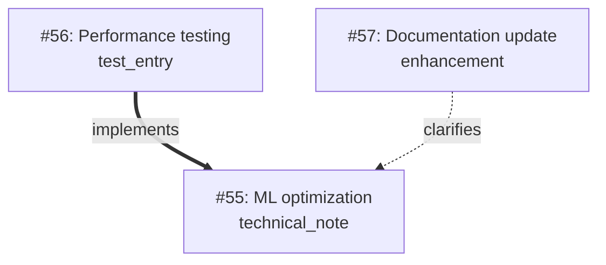

# Memory Journal MCP Server

Last Updated October 26, 2025 - Production/Stable v1.2.1

[](https://github.com/neverinfamous/memory-journal-mcp)
[](https://hub.docker.com/r/writenotenow/memory-journal-mcp)
[](https://opensource.org/licenses/MIT)


[](https://pypi.org/project/memory-journal-mcp/)
[](https://github.com/neverinfamous/memory-journal-mcp/blob/main/SECURITY.md)
[](https://github.com/neverinfamous/memory-journal-mcp)
[](https://github.com/neverinfamous/memory-journal-mcp)

**Production-ready developer journal with knowledge graphs, visual relationship mapping, intelligent search, and advanced GitHub Projects integration**

🎉 **Now with V1.1** Build your personal knowledge graph with 16 tools, 10 workflow prompts, and advanced project analytics.

**🚀 Multiple Deployment Options:**
- **[Docker Hub](https://hub.docker.com/r/writenotenow/memory-journal-mcp)** - Alpine-based (~225MB) multi-platform support
- **[PyPI Package](https://pypi.org/project/memory-journal-mcp/)** - Simple `pip install` for local deployment
- **[MCP Registry](https://registry.modelcontextprotocol.io/v0/servers?search=io.github.neverinfamous/memory-journal-mcp)** - Discoverable by MCP clients

**📚 Full Documentation:** [GitHub Wiki](https://github.com/neverinfamous/memory-journal-mcp/wiki)

**📰 [Read the v1.1.2 Release Article](https://adamic.tech/articles/2025-10-04-memory-journal-mcp-v1-1-2)** - Learn about knowledge graphs, performance optimizations, and relationship mapping

---

## ✨ What's New in v1.2.1 (Patch Release - October 26, 2025)

### 🐛 **Critical Bug Fix: Semantic Search Initialization**
Fixed a critical async/lazy loading race condition that could cause semantic search to hang on first use:
- **First semantic_search now completes in <1 second** (was: could timeout after 30+ seconds)
- **Eliminated async lock deadlocks** during ML model loading
- **Enhanced thread pool** from 2 to 4 workers for better concurrent operations
- **No more need to cancel and retry** - reliable semantic search on every server restart

This patch release maintains full compatibility with v1.2.0 - simply upgrade and restart your MCP client.

---

## ✨ What's New in v1.2.0 (Organization Support)

### 🏢 **Organization-Level GitHub Projects** - Team Collaboration Ready
Full support for organization-level projects alongside user projects:
- **Automatic Owner Detection** - Detects whether repo belongs to user or organization
- **Dual Project Lookup** - Shows both user and org projects in context
- **Org Project Analytics** - All features work seamlessly with org projects
- **Separate Token Support** - Optional `GITHUB_ORG_TOKEN` for org-specific permissions
- **Zero Breaking Changes** - Fully backward compatible

### 🔧 **Enhanced Features for Organizations**
All advanced project analytics now support org projects:
- **Cross-Project Insights** - Analyze patterns across user AND org projects
- **Status Summaries** - Comprehensive reports for org project teams
- **Milestone Tracking** - Track org-level milestones and team velocity
- **Project Timelines** - Combined journal + GitHub activity for org projects
- **Smart Caching** - 80%+ API reduction for both user and org projects (24hr owner type cache, 1hr project cache)

### 📊 **Advanced Project Analytics** - Deep Insights Across Projects
- **Cross-Project Insights** - Analyze patterns across all tracked projects
- **Project Breakdown** - Time distribution and activity analysis per project  
- **Velocity Tracking** - Measure productivity with entries per week
- **Smart Caching** - 80%+ reduction in API calls with intelligent caching (1hr TTL)
- **Inactive Project Detection** - Automatically identify projects needing attention

### 📈 **Project Status & Milestone Tracking**
- **Status Summary Prompt** - Comprehensive project reports with GitHub data integration
- **Milestone Tracker** - Progress visualization with velocity charts
- **Project Timeline Resource** - Live activity feed combining journal + GitHub events
- **Item Status Monitoring** - Track completion rates and project item states

### 🔗 **GitHub Projects Integration** - Enhanced Context Awareness
- **Automatic Project Detection** - Detects GitHub Projects associated with current repository (user & org)
- **Active Work Items** - Shows what you're actively working on from projects
- **Entry-Project Linking** - Associate journal entries with specific projects and items
- **Project Filtering** - Search and filter entries by project number
- **Graceful Degradation** - Works perfectly without GitHub token (features degrade gracefully)

### 🎉 **v1.2.0 Summary** (October 26, 2025)
Building on the stable v1.1.3 foundation:
- **16 MCP tools** (up from 15) - Added `get_cross_project_insights`
- **10 workflow prompts** (up from 8) - Added `project-status-summary` and `project-milestone-tracker`
- **4 MCP resources** (up from 3) - Added `memory://projects/{number}/timeline`
- **Smart caching system** - GitHub API response caching with configurable TTLs
- **Enhanced analytics** - Project breakdown support in `get_statistics`
- **Backward compatible** - Seamless upgrade from v1.1.x with automatic schema migration

### 🔗 Knowledge Graph & Visual Mapping
Build connections between your work and see how ideas evolve:



**5 Relationship Types:**
- `references` - General connections
- `implements` - Link implementations to specs
- `clarifies` - Add explanations
- `evolves_from` - Track idea evolution
- `response_to` - Thread conversations

### ⚡ Performance Revolution
- **10x faster startup** - 14s → 2-3s via lazy ML loading
- **Thread-safe operations** - Zero race conditions
- **Database lock prevention** - Single-connection transactions
- **Optimized queries** - Strategic indexes for relationships

### 🛠️ New Tools & Capabilities
- `visualize_relationships` - Generate Mermaid diagrams with depth control
- `link_entries` - Create typed relationships between entries
- Enhanced `update_entry` - Thread-safe tag creation
- Enhanced `delete_entry` - Soft delete with recovery option
- Enhanced `get_entry_by_id` - Shows full relationship graph

---

## 🚀 Quick Start (2 Minutes)

### 1. Pull the Image

```bash
docker pull writenotenow/memory-journal-mcp:latest
```

### 2. Create Data Directory

```bash
mkdir data
```

### 3. Add to MCP Config

Add this to your `~/.cursor/mcp.json`:

```json
{
  "mcpServers": {
    "memory-journal": {
      "command": "docker",
      "args": [
        "run", "--rm", "-i",
        "-v", "./data:/app/data",
        "writenotenow/memory-journal-mcp:latest",
        "python", "src/server.py"
      ]
    }
  }
}
```

### 4. Restart & Journal!

Restart Cursor or your MCP client and start journaling!

---

## ⚡ **Install to Cursor IDE**

### **One-Click Installation**

Click the button below to install directly into Cursor:

[](cursor://anysphere.cursor-deeplink/mcp/install?name=Memory%20Journal%20MCP&config=eyJtZW1vcnktam91cm5hbCI6eyJhcmdzIjpbInJ1biIsIi0tcm0iLCItaSIsIi12IiwiLi9kYXRhOi9hcHAvZGF0YSIsIndyaXRlbm90ZW5vdy9tZW1vcnktam91cm5hbC1tY3A6bGF0ZXN0IiwicHl0aG9uIiwic3JjL3NlcnZlci5weSJdLCJjb21tYW5kIjoiZG9ja2VyIn19)

Or copy this deep link:
```
cursor://anysphere.cursor-deeplink/mcp/install?name=Memory%20Journal%20MCP&config=eyJtZW1vcnktam91cm5hbCI6eyJhcmdzIjpbInJ1biIsIi0tcm0iLCItaSIsIi12IiwiLi9kYXRhOi9hcHAvZGF0YSIsIndyaXRlbm90ZW5vdy9tZW1vcnktam91cm5hbC1tY3A6bGF0ZXN0IiwicHl0aG9uIiwic3JjL3NlcnZlci5weSJdLCJjb21tYW5kIjoiZG9ja2VyIn19
```

### **Prerequisites**
- ✅ Docker installed and running
- ✅ ~500MB disk space available

**📖 [See Full Installation Guide →](https://github.com/neverinfamous/memory-journal-mcp/wiki/Installation)**

---

## 🛡️ Supply Chain Security

For enhanced security and reproducible builds, use SHA-pinned images:

**Find SHA tags:** https://hub.docker.com/r/writenotenow/memory-journal-mcp/tags

**Option 1: Multi-arch manifest (recommended)**
```bash
docker pull writenotenow/memory-journal-mcp:sha256-<manifest-digest>
```

**Option 2: Direct digest (maximum security)**
```bash
docker pull writenotenow/memory-journal-mcp@sha256:<manifest-digest>
```

**Security Features:**
- ✅ **Build Provenance** - Cryptographic proof of build process
- ✅ **SBOM Available** - Complete software bill of materials
- ✅ **Supply Chain Attestations** - Verifiable build integrity
- ✅ **Non-root Execution** - Minimal attack surface

---

## ⚡ Core Features

### 🛠️ 15 MCP Tools - Complete Development Workflow

**Entry Management:**
- `create_entry` / `create_entry_minimal` - Create with auto-context and GitHub Projects linking
- `update_entry` - Edit entries (thread-safe tag creation)
- `delete_entry` - Soft or permanent deletion with recovery
- `get_entry_by_id` - Retrieve with full relationship graph and project info

**Search & Discovery:**
- `search_entries` - FTS5 full-text with result highlighting and project filtering
- `search_by_date_range` - Time-based filtering with tags and projects
- `semantic_search` - ML-powered similarity search (optional)
- `get_recent_entries` - Quick access to recent work

**Relationships & Visualization:**
- `link_entries` - Create typed relationships (5 types)
- `visualize_relationships` - Generate Mermaid diagrams with depth control

**Organization & Analytics:**
- `list_tags` - Tag usage statistics
- `get_statistics` - Comprehensive analytics by time period
- `export_entries` - JSON/Markdown export with filtering
- `test_simple` - Connectivity testing

### 🎯 8 Workflow Prompts - Automated Productivity

- **`prepare-standup`** - Daily standup summaries from recent entries
- **`prepare-retro`** - Sprint retrospectives with achievements and learnings
- **`weekly-digest`** - Day-by-day weekly summaries with highlights
- **`analyze-period`** - Deep analysis with pattern insights and trends
- **`goal-tracker`** - Milestone and achievement tracking
- **`find-related`** - Discover connected entries via semantic similarity
- **`get-context-bundle`** - Complete project context (Git + GitHub)
- **`get-recent-entries`** - Formatted display of recent work

### 🔍 Triple Search System - Find Anything, Any Way

1. **Full-text** - SQLite FTS5 with result highlighting and rank ordering
2. **Date range** - Time-based filtering with tag and type filters
3. **Semantic** - FAISS vector similarity for concept-based discovery (optional)

All three search modes work independently or can be combined for powerful discovery.

### 📊 Visual Relationship Graphs - See How Work Connects

Generate beautiful Mermaid diagrams showing how your entries relate:
- **5 relationship types** - references, implements, clarifies, evolves_from, response_to
- **3 visualization modes** - Entry-centric, tag-based, or recent activity
- **Customizable depth** - Control relationship traversal (1-3 hops)
- **Tag filtering** - Focus on specific projects or topics
- **Color-coded nodes** - Personal (blue) vs Project (orange) entries
- **Typed arrows** - Different styles for different relationship types

### 🔄 Git & GitHub Integration - Automatic Context Capture

Every entry can automatically include:
- Repository name and path
- Current branch
- Latest commit (hash + message)
- Recent GitHub issues (via `gh` CLI)
- **GitHub Projects** - Automatic project detection and tracking (user & org)
- **Organization Support** - Full support for org-level projects alongside user projects
- **Project Analytics** - Cross-project insights, status summaries, milestone tracking (user & org)
- **Smart API Caching** - 80%+ API call reduction (24hr owner type, 1hr projects, 15min items)
- **Auto Owner Detection** - Automatically determines if repo belongs to user or organization
- Working directory
- Timestamp for all context

Perfect for maintaining project journals with rich development context.

---

## 📖 Usage Examples

### Create Entries with GitHub Projects

```javascript
// Create entry linked to GitHub Project
create_entry({
  content: "Completed Phase 1 of GitHub Projects integration",
  entry_type: "technical_achievement",
  tags: ["github-projects", "integration", "milestone"],
  project_number: 1,  // Links to GitHub Project #1
  significance_type: "technical_breakthrough"
})
// Context automatically includes GitHub Projects info

// Search entries by project
search_entries({
  project_number: 1,
  limit: 10
})
```

### Create & Link Entries

```javascript
// Create technical entry
create_entry({
  content: "Implemented lazy ML loading for 10x faster startup",
  entry_type: "technical_achievement",
  tags: ["performance", "optimization"],
  significance_type: "technical_breakthrough"
})
// → Entry #55

// Link implementation to spec
link_entries({
  from_entry_id: 56,
  to_entry_id: 55,
  relationship_type: "implements"
})

// Visualize connections
visualize_relationships({
  entry_id: 55,
  depth: 2
})
```

### Search & Analyze

```javascript
// Full-text search
search_entries({ query: "startup performance", limit: 5 })

// Semantic search
semantic_search({ query: "optimization techniques", limit: 3 })

// Date range with tags and projects
search_by_date_range({
  start_date: "2025-10-01",
  end_date: "2025-10-31",
  tags: ["performance"],
  project_number: 1
})

// Get analytics
get_statistics({ group_by: "week" })

// Export to Markdown
export_entries({
  format: "markdown",
  start_date: "2025-10-01",
  tags: ["milestone"]
})
```

### Access Resources

```javascript
// Recent entries JSON
memory://recent

// Significant entries
memory://significant

// Live relationship graph
memory://graph/recent
```

---

## 🔧 Configuration

### Data Persistence

Mount `./data:/app/data` to persist your SQLite database:
- Database auto-creates on first run
- All entries, tags, and relationships stored locally
- Single `.db` file - easy to backup/move

### Environment Variables (Optional)

**Enable debug logging:**

```bash
-e DEBUG=true
```

**Custom database path:**

```bash
-e DB_PATH=/app/data/custom.db
```

**GitHub Projects Integration:**

To enable GitHub Projects features, pass your GitHub token:

```bash
docker run --rm -i \
  -v ./data:/app/data \
  -e GITHUB_TOKEN=your_github_token_here \
  writenotenow/memory-journal-mcp:latest \
  python src/server.py
```

**Organization Projects:**

For organization-level projects, you can optionally use a separate token:

```bash
docker run --rm -i \
  -v ./data:/app/data \
  -e GITHUB_TOKEN=your_personal_token \
  -e GITHUB_ORG_TOKEN=your_org_token \
  -e DEFAULT_ORG=your-org-name \
  writenotenow/memory-journal-mcp:latest \
  python src/server.py
```

**Required Token Scopes:**
- User projects: `repo`, `project`
- Org projects: `repo`, `project`, `read:org` (minimum)
- Full org features: Add `admin:org` for team info

**Fallback Options:**
- Uses GitHub CLI (`gh`) if `GITHUB_TOKEN` is not available
- Uses `GITHUB_TOKEN` if `GITHUB_ORG_TOKEN` not set
- Works without GitHub token (project features gracefully disabled)
- Auto-detects whether owner is user or organization

### Security Features
- **WAL mode** - Better concurrency and crash recovery
- **Input validation** - SQL injection prevention
- **Non-root execution** - Minimal privileges
- **Local-first** - No external data transmission
- **Thread-safe operations** - Zero race conditions

---

## 📦 Image Details

| Platform | Size | Features | Startup Time |
|----------|------|----------|--------------|
| **AMD64** (x86_64) | 231MB | Complete: journaling, FTS5, semantic search, Git context, PyTorch ML, relationship graphs, knowledge graph visualization | ~2-3 seconds |
| **ARM64** (Apple Silicon) | 207MB | Core: journaling, FTS5 search, Git context, relationship graphs, knowledge graph visualization (semantic search unavailable) | ~2-3 seconds |

**Production-Ready Image:**
- **Python 3.13.x on Alpine Linux** - Latest Python with minimal attack surface (225MB avg vs 500MB+ for Ubuntu)
- **Multi-Platform Support** - AMD64 with full ML, ARM64 with core features
- **ML Capabilities (AMD64)** - PyTorch + sentence-transformers + FAISS
- **Graceful Degradation (ARM64)** - Core features work without ML dependencies
- **10x Faster Startup** - Lazy loading reduces init from 14s → 2-3s
- **Production/Stable** - Comprehensive error handling and automatic migrations
- **Zero Race Conditions** - Thread-safe tag creation and single-connection transactions
- **Latest Python Features** - PEP 779 (free-threaded), PEP 649 (deferred annotations), enhanced performance

**Automated Deployment:**
- ⚡ **Always Fresh** - Images built within 5-10 minutes of commits
- 🔒 **Security Scanned** - Automatic vulnerability scanning
- 🌍 **Multi-Platform** - Intel (amd64) and Apple Silicon (arm64)
- ✅ **Quality Tested** - Automated testing before deployment
- 📋 **SBOM Available** - Complete software bill of materials
- 🔐 **Build Provenance** - Cryptographic proof of build process

**Note:** ARM64 images don't include semantic search due to PyTorch Alpine incompatibility. All other features (FTS5 search, relationships, Git integration, visualization) work identically on both platforms.

**Available Tags:**
- `1.2.1` - Specific version (recommended for production)
- `1.2` - Latest patch in 1.2.x series
- `1` - Latest minor in 1.x series
- `latest` - Always the newest version
- `sha256-<digest>` - SHA-pinned for maximum security

---

## 🏗️ Build from Source

**Step 1: Clone the repository**

```bash
git clone https://github.com/neverinfamous/memory-journal-mcp.git
cd memory-journal-mcp
```

**Step 2: Build the Docker image**

```bash
docker build -f Dockerfile -t memory-journal-mcp-local .
```

**Step 3: Add to MCP config**

Update your `~/.cursor/mcp.json` to use the local build:

```json
{
  "mcpServers": {
    "memory-journal": {
      "command": "docker",
      "args": [
        "run", "--rm", "-i",
        "-v", "./data:/app/data",
        "memory-journal-mcp-local",
        "python", "src/server.py"
      ]
    }
  }
}
```

---

## 📚 Documentation

**Complete documentation:** [GitHub Wiki](https://github.com/neverinfamous/memory-journal-mcp/wiki)

**Key Topics:**
- [Installation Guide](https://github.com/neverinfamous/memory-journal-mcp/wiki/Installation)
- [Tools Reference](https://github.com/neverinfamous/memory-journal-mcp/wiki/Tools) - All 15 tools documented
- [Prompts Guide](https://github.com/neverinfamous/memory-journal-mcp/wiki/Prompts) - 8 workflow prompts
- [Visualization](https://github.com/neverinfamous/memory-journal-mcp/wiki/Visualization) - Relationship graphs
- [Examples](https://github.com/neverinfamous/memory-journal-mcp/wiki/Examples) - Real-world usage
- [Architecture](https://github.com/neverinfamous/memory-journal-mcp/wiki/Architecture) - Technical deep dive

### GitHub Gists: Practical Examples & Real-World Use Cases

**[→ View All Memory Journal Gists](https://gist.github.com/neverinfamous/ffedec3bdb5da08376a381733b80c1a7)**

Explore 5 curated gists with practical examples and implementation patterns:

1. **[Complete Feature Showcase](https://gist.github.com/neverinfamous/ffedec3bdb5da08376a381733b80c1a7)** - All 15 tools, 8 prompts, and 3 resources
2. **[Relationship Mapping & Knowledge Graphs](https://gist.github.com/neverinfamous/e5f3638dc76b2536df04a02af9647abd)** - Build knowledge graphs with typed relationships
3. **[Triple Search System Guide](https://gist.github.com/neverinfamous/a484535fea7014e8822887abbd8abb38)** - Master FTS5, date range, and semantic search
4. **[Workflow Automation & Prompts](https://gist.github.com/neverinfamous/5d77fb0bf37179effcdc64ecce4f4de2)** - Standup, retrospectives, and weekly digests
5. **[Git Integration & Context Capture](https://gist.github.com/neverinfamous/bf31ca9f0949993275d9d947a2284598)** - Automatic project context from Git and GitHub

---

## 🔗 Links

**Project Resources:**
- **GitHub**: https://github.com/neverinfamous/memory-journal-mcp
- **Wiki**: https://github.com/neverinfamous/memory-journal-mcp/wiki
- **GitHub Gists**: https://gist.github.com/neverinfamous/ffedec3bdb5da08376a381733b80c1a7 - 5 practical examples and use cases
- **PyPI**: https://pypi.org/project/memory-journal-mcp/
- **MCP Registry**: https://registry.modelcontextprotocol.io/v0/servers?search=io.github.neverinfamous/memory-journal-mcp
- **Issues**: https://github.com/neverinfamous/memory-journal-mcp/issues
- **Support**: https://adamic.tech/

**Distribution:**
- **Docker Hub**: https://hub.docker.com/r/writenotenow/memory-journal-mcp
- **Security**: SHA-pinned images available for compliance
- **Updates**: Auto-deployed on every commit to `main`

---

## 📄 License

MIT License - See [LICENSE](https://github.com/neverinfamous/memory-journal-mcp/blob/main/LICENSE)

---

**Built by developers, for developers.** PRs welcome! 🚀
