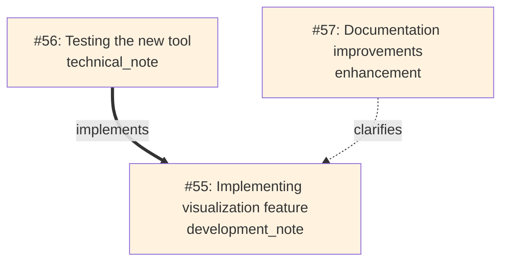

# 🛠️ Memory Journal MCP Server

*Last Updated October 4, 2025*

[](https://github.com/neverinfamous/memory-journal-mcp)


[](https://hub.docker.com/r/writenotenow/memory-journal-mcp)
[](https://pypi.org/project/memory-journal-mcp/)

*A developer's project journal with Git integration, semantic search, and visual relationship mapping*

**🚀 Quick Deploy:**
- **[PyPI Package](https://pypi.org/project/memory-journal-mcp/)** - `pip install memory-journal-mcp`
- **[Docker Hub](https://hub.docker.com/r/writenotenow/memory-journal-mcp)** - Alpine-based (225MB) with full semantic search
- **[MCP Registry](https://registry.modelcontextprotocol.io/)** - Discoverable by MCP clients

**📚 Full Documentation:** [GitHub Wiki](https://github.com/neverinfamous/memory-journal-mcp/wiki)

---

## ✨ What's New in v1.1.0

### 🔗 **Entry Relationships**
Link entries with typed relationships to build your knowledge graph:
- `evolves_from` - Track how ideas develop
- `references` - Connect related work
- `implements` - Link implementations to specs
- `clarifies` - Add explanations
- `response_to` - Thread conversations

### 📊 **Visual Relationship Mapping**
Generate beautiful Mermaid diagrams to visualize how your entries connect:



**New Tools:**
- `visualize_relationships` - Generate graph visualizations with depth control and tag filtering
- `link_entries` - Create typed relationships between entries
- `update_entry` - Edit existing entries
- `delete_entry` - Soft or permanent deletion
- `get_entry_by_id` - Retrieve entries with full relationship details
- `search_by_date_range` - Time-based filtering
- `get_statistics` - Comprehensive analytics
- `export_entries` - JSON/Markdown export

**New Resources:**
- `memory://graph/recent` - Live relationship graph of recent entries

**Enhanced Features:**
- ⚡ **10x faster startup** - Lazy loading of ML dependencies (~2-3 seconds vs 14 seconds)
- 🔒 **Thread-safe tag creation** - Zero race conditions
- 🛡️ **Database lock prevention** - Single-connection transactions
- 🎨 **8 workflow prompts** - Standups, retros, weekly digests, goal tracking

---

## 🚀 Quick Start

### Option 1: PyPI (Fastest - 30 seconds)

```bash
# Install
pip install memory-journal-mcp

# Add to ~/.cursor/mcp.json
{
  "mcpServers": {
    "memory-journal": {
      "command": "memory-journal-mcp"
    }
  }
}

# Restart Cursor → Start journaling!
```

### Option 2: Docker (Full Features - 2 minutes)

```bash
# Pull image
docker pull writenotenow/memory-journal-mcp:latest

# Create data directory
mkdir data

# Add to ~/.cursor/mcp.json
{
  "mcpServers": {
    "memory-journal": {
      "command": "docker",
      "args": [
        "run", "--rm", "-i", 
        "-v", "./data:/app/data",
        "writenotenow/memory-journal-mcp:latest",
        "python", "src/server.py"
      ]
    }
  }
}

# Restart Cursor → Start journaling!
```

---

## 📋 Core Capabilities

### 🛠️ **15 MCP Tools**
Complete CRUD operations, triple search system (FTS5 + date + semantic), relationships, analytics, and data export.

### 🎯 **8 Workflow Prompts**
Interactive prompts for standups, retrospectives, weekly digests, period analysis, goal tracking, and context bundles.

### 🔍 **Triple Search System**
- **Full-text search** - SQLite FTS5 with highlighting
- **Date range search** - Time-based filtering with tags
- **Semantic search** - FAISS vector similarity (optional)

### 🔗 **Entry Relationships**
Build a knowledge graph with typed relationships and visualize connections with Mermaid diagrams.

### 📊 **Comprehensive Analytics**
Track entry counts, top tags, activity patterns by week/month, and significant milestones.

### 🎨 **Visual Relationship Graphs**
Generate Mermaid diagrams showing how entries connect, with customizable depth and filtering.

### 🔄 **Git & GitHub Integration**
Auto-captures commits, branches, repo info, and recent issues for project context.

### 📦 **Data Export**
Export to JSON or Markdown with flexible filtering by date, tags, and entry types.

---

## 📖 Usage Examples

### Create an Entry with Relationships

```javascript
// Create a technical achievement
create_entry({
  content: "Implemented lazy loading for ML dependencies - 10x faster startup!",
  entry_type: "technical_achievement",
  tags: ["performance", "optimization", "ml"],
  significance_type: "technical_breakthrough"
})
// Returns: Entry #55

// Link related work
link_entries({
  from_entry_id: 56,  // Testing entry
  to_entry_id: 55,    // Implementation
  relationship_type: "implements"
})

// Visualize the connections
visualize_relationships({
  entry_id: 55,
  depth: 2
})
```

### Search and Analyze

```javascript
// Full-text search with highlighting
search_entries({ query: "performance optimization", limit: 5 })

// Semantic search for concepts
semantic_search({ query: "startup time improvements", limit: 3 })

// Date range with tags
search_by_date_range({
  start_date: "2025-10-01",
  end_date: "2025-10-31",
  tags: ["performance"]
})

// Get analytics
get_statistics({ group_by: "week" })
```

### Generate Visual Maps

```javascript
// Visualize entry relationships
visualize_relationships({
  entry_id: 55,  // Root entry
  depth: 2       // 2 hops out
})

// Filter by tags
visualize_relationships({
  tags: ["visualization", "relationships"],
  limit: 20
})

// Access live graph resource
memory://graph/recent  // Most recent 20 entries with relationships
```

---

## 🏗️ Architecture

```
┌─────────────────────────────────────────────────────────────┐
│ MCP Server Layer (Async/Await)                              │
│  ┌─────────────────┐  ┌─────────────────┐  ┌─────────────┐  │
│  │ Entry Creation  │  │ Triple Search   │  │ Relationship│  │
│  │ with Context    │  │ FTS5/Date/ML    │  │ Mapping     │  │
│  └─────────────────┘  └─────────────────┘  └─────────────┘  │
├─────────────────────────────────────────────────────────────┤
│ Thread Pool Execution Layer                                 │
│  ┌─────────────────┐  ┌─────────────────┐  ┌─────────────┐  │
│  │ Git Operations  │  │ Database Ops    │  │ Lazy ML     │  │
│  │ (2s timeout)    │  │ Single Conn     │  │ Loading     │  │
│  └─────────────────┘  └─────────────────┘  └─────────────┘  │
├─────────────────────────────────────────────────────────────┤
│ SQLite Database with FTS5 + Relationships                   │
│  ┌─────────────────────────────────────────────────────────┐│
│  │ entries + tags + relationships + embeddings + FTS       ││
│  └─────────────────────────────────────────────────────────┘│
└─────────────────────────────────────────────────────────────┘
```

---

## 🔧 Technical Highlights

### Performance & Security
- **10x faster startup** - Lazy loading of ML dependencies (2-3s vs 14s)
- **Thread-safe operations** - Zero race conditions in tag creation
- **WAL mode** - Better concurrency and crash recovery
- **Database lock prevention** - Single-connection transactions
- **Aggressive timeouts** - Git operations fail-fast (2s per command)
- **Input validation** - Length limits, parameterized queries, SQL injection prevention

### Semantic Search (Optional)
- **Model**: `all-MiniLM-L6-v2` (384-dimensional embeddings)
- **Storage**: FAISS index for fast similarity search
- **Graceful degradation**: Works perfectly without ML dependencies

### Data & Privacy
- **Local-first**: Single SQLite file, you own your data
- **Portable**: Move your `.db` file anywhere
- **Secure**: No external API calls, non-root Docker containers

---

## 📚 Documentation

**Full documentation available on the [GitHub Wiki](https://github.com/neverinfamous/memory-journal-mcp/wiki):**

- [Installation Guide](https://github.com/neverinfamous/memory-journal-mcp/wiki/Installation)
- [Tools Reference](https://github.com/neverinfamous/memory-journal-mcp/wiki/Tools)
- [Prompts Guide](https://github.com/neverinfamous/memory-journal-mcp/wiki/Prompts)
- [Relationship Visualization](https://github.com/neverinfamous/memory-journal-mcp/wiki/Visualization)
- [Examples & Tutorials](https://github.com/neverinfamous/memory-journal-mcp/wiki/Examples)
- [Architecture Deep Dive](https://github.com/neverinfamous/memory-journal-mcp/wiki/Architecture)

---

## 🔗 Resources

- **[GitHub Wiki](https://github.com/neverinfamous/memory-journal-mcp/wiki)** - Complete documentation
- **[Docker Hub](https://hub.docker.com/r/writenotenow/memory-journal-mcp)** - Container images
- **[PyPI Package](https://pypi.org/project/memory-journal-mcp/)** - Python package
- **[MCP Registry](https://registry.modelcontextprotocol.io/)** - Official MCP listing
- **[GitHub Issues](https://github.com/neverinfamous/memory-journal-mcp/issues)** - Bug reports & feature requests
- **[Adamic Support](https://adamic.tech/)** - Project announcements

---

## 📄 License

MIT License - See [LICENSE](LICENSE) file for details.

## 🤝 Contributing

Built by developers, for developers. PRs welcome! See [CONTRIBUTING.md](CONTRIBUTING.md) for guidelines.
