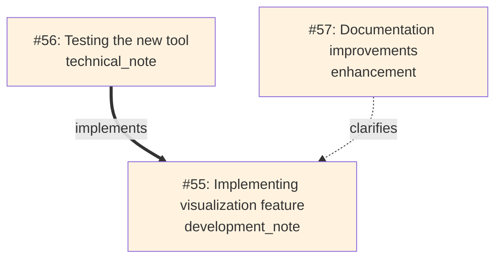

# Memory Journal MCP Server

Last Updated October 26, 2025 - Production/Stable v1.2.2

<!-- mcp-name: io.github.neverinfamous/memory-journal-mcp -->

[](https://github.com/neverinfamous/memory-journal-mcp)
[](https://hub.docker.com/r/writenotenow/memory-journal-mcp)
[](https://opensource.org/licenses/MIT)


[](https://registry.modelcontextprotocol.io/v0/servers?search=io.github.neverinfamous/memory-journal-mcp)
[](https://pypi.org/project/memory-journal-mcp/)
[](SECURITY.md)
[](https://github.com/neverinfamous/memory-journal-mcp/security/code-scanning)
[](https://github.com/neverinfamous/memory-journal-mcp)

*A production-ready developer journal with knowledge graphs, visual relationship mapping, and intelligent search*

**🎉 Now Production/Stable!** Memory Journal has graduated from beta with powerful relationship mapping, 10x faster startup, and comprehensive documentation.

**🚀 Quick Deploy:**
- **[PyPI Package](https://pypi.org/project/memory-journal-mcp/)** - `pip install memory-journal-mcp`
- **[Docker Hub](https://hub.docker.com/r/writenotenow/memory-journal-mcp)** - Alpine-based (225MB) with full semantic search
- **[MCP Registry](https://registry.modelcontextprotocol.io/v0/servers?search=io.github.neverinfamous/memory-journal-mcp)** - Discoverable by MCP clients

**📚 Full Documentation:** [GitHub Wiki](https://github.com/neverinfamous/memory-journal-mcp/wiki)

**📰 [Read the v1.1.2 Release Article](https://adamic.tech/articles/2025-10-04-memory-journal-mcp-v1-1-2)** - Learn about knowledge graphs, performance optimizations, and relationship mapping

---

## ✨ What's New in v1.2.2 (Security Patch - October 26, 2025)

### 🔒 **Security Fix: URL Parsing Vulnerability (CodeQL #110, #111)**
Fixed incomplete URL substring sanitization in GitHub remote URL parsing:
- **Proper URL validation** - Implemented `urllib.parse.urlparse()` with exact hostname matching
- **Prevented URL spoofing** - Blocks malicious URLs like `http://evil.com/github.com/fake/repo`
- **Enhanced security** - SSH URLs use explicit prefix validation, HTTPS URLs use proper parsing
- **No breaking changes** - Drop-in replacement maintaining full compatibility

### Technical Details
- **Vulnerability**: CWE-20 (Improper Input Validation)
- **Severity**: Medium (limited to Git remote URL parsing in local repositories)
- **Fix**: Replaced substring checks (`'github.com' in url`) with proper `urlparse()` validation
- **Reference**: [CodeQL Rule py/incomplete-url-substring-sanitization](https://codeql.github.com/codeql-query-help/python/py-incomplete-url-substring-sanitization/)

This security patch maintains full compatibility with v1.2.x - simply upgrade to receive the fix.

---

## ✨ What's New in v1.2.1 (Patch Release - October 26, 2025)

### 🐛 **Critical Bug Fix: Semantic Search Initialization**
Fixed a critical async/lazy loading race condition that could cause semantic search to hang on first use:
- **First semantic_search now completes in <1 second** (was: could timeout after 30+ seconds)
- **Eliminated async lock deadlocks** during ML model loading
- **Enhanced thread pool** from 2 to 4 workers for better concurrent operations
- **No more need to cancel and retry** - reliable semantic search on every server restart

This patch release maintains full compatibility with v1.2.0 - simply upgrade and restart your MCP client.

---

## ✨ What's New in v1.2.0 (Organization Support)

### 🏢 **Organization-Level GitHub Projects** - Team Collaboration Ready
Full support for organization-level projects alongside user projects:
- **Automatic Owner Detection** - Detects whether repo belongs to user or organization
- **Dual Project Lookup** - Shows both user and org projects in context
- **Org Project Analytics** - All features work seamlessly with org projects
- **Separate Token Support** - Optional `GITHUB_ORG_TOKEN` for org-specific permissions
- **Zero Breaking Changes** - Fully backward compatible

### 🔧 **Enhanced Features for Organizations**
All advanced project analytics now support org projects:
- **Cross-Project Insights** - Analyze patterns across user AND org projects
- **Status Summaries** - Comprehensive reports for org project teams
- **Milestone Tracking** - Track org-level milestones and team velocity
- **Project Timelines** - Combined journal + GitHub activity for org projects
- **Smart Caching** - 80%+ API reduction for both user and org projects (24hr owner type cache, 1hr project cache)

### 📊 **Advanced Project Analytics** - Deep Insights Across Projects
- **Cross-Project Insights** - Analyze patterns across all tracked projects
- **Project Breakdown** - Time distribution and activity analysis per project
- **Velocity Tracking** - Measure productivity with entries per week
- **Smart Caching** - 80%+ reduction in API calls with intelligent caching (1hr TTL)
- **Inactive Project Detection** - Automatically identify projects needing attention

### 📈 **Project Status & Milestone Tracking**
- **Status Summary Prompt** - Comprehensive project reports with GitHub data integration
- **Milestone Tracker** - Progress visualization with velocity charts
- **Project Timeline Resource** - Live activity feed combining journal + GitHub events
- **Item Status Monitoring** - Track completion rates and project item states

### 🔗 **GitHub Projects Integration** - Enhanced Context Awareness
Seamlessly connect your journal entries with GitHub Projects:
- **Automatic Project Detection** - Detects GitHub Projects associated with current repository (user & org)
- **Active Work Items** - Shows what you're actively working on from projects
- **Entry-Project Linking** - Associate journal entries with specific projects and items
- **Project Filtering** - Search and filter entries by project number
- **Graceful Degradation** - Works perfectly without GitHub token (features degrade gracefully)

### 🎉 **v1.2.0 - Capabilities**
Building on the stable v1.1.3 foundation:
- **16 MCP tools** (up from 15) - Added `get_cross_project_insights`
- **10 workflow prompts** (up from 8) - Added `project-status-summary` and `project-milestone-tracker`
- **4 MCP resources** (up from 3) - Added `memory://projects/{number}/timeline`
- **Smart caching system** - GitHub API response caching with configurable TTLs
- **Enhanced analytics** - Project breakdown support in `get_statistics`
- **Backward compatible** - Seamless upgrade from v1.1.x with automatic schema migration

### 🔗 **Entry Relationships & Knowledge Graphs**
Build connections between your entries with typed relationships:
- `references` - General connections between work
- `implements` - Link implementations to specs/designs
- `clarifies` - Add explanations and elaborations
- `evolves_from` - Track how ideas develop over time
- `response_to` - Thread conversations and replies

### 📊 **Visual Relationship Mapping**
Generate beautiful Mermaid diagrams showing how your work connects:



### ⚡ **Performance Revolution**
- **10x faster startup** - Lazy loading reduces init time from 14s → 2-3s
- **Thread-safe operations** - Zero race conditions in concurrent tag creation
- **Database lock prevention** - Single-connection transactions eliminate conflicts
- **Optimized queries** - Strategic indexes for relationship traversal

### 🛠️ **New Tools** (15 Total, +2 from v1.0)
- `visualize_relationships` - Generate Mermaid diagrams with depth control
- `link_entries` - Create typed relationships between entries
- Plus comprehensive CRUD, triple search, analytics, and export

### 🎯 **Enhanced Workflow Prompts** (8 Total, +2 from v1.0)
- `find-related` - Discover connected entries via semantic similarity
- `prepare-standup` - Daily standup summaries
- `prepare-retro` - Sprint retrospectives
- `weekly-digest` - Day-by-day weekly summaries
- `analyze-period` - Deep period analysis with insights
- `goal-tracker` - Milestone and achievement tracking
- `get-context-bundle` - Project context with Git/GitHub
- `get-recent-entries` - Formatted recent entries

### 📡 **New Resources** (3 Total, +1 from v1.0)
- `memory://graph/recent` - **NEW** Live Mermaid diagram of recent relationships
- `memory://recent` - 10 most recent entries
- `memory://significant` - Significant milestones and breakthroughs

### 🗄️ **Database Improvements**
- Automatic schema migrations (seamless v1.0 → v1.1 upgrades)
- Soft delete support with `deleted_at` column
- New `relationships` table with cascading deletes
- Enhanced indexes for optimal query performance

---

## 🚀 Quick Start

### Option 1: PyPI (Fastest - 30 seconds)

**Step 1: Install the package**

```bash
pip install memory-journal-mcp
```

**Step 2: Add to ~/.cursor/mcp.json**

```json
{
  "mcpServers": {
    "memory-journal": {
      "command": "memory-journal-mcp"
    }
  }
}
```

**Step 3: Restart Cursor**

Restart Cursor or your MCP client, then start journaling!

### Option 2: Docker (Full Features - 2 minutes)

**Step 1: Pull the Docker image**

```bash
docker pull writenotenow/memory-journal-mcp:latest
```

**Step 2: Create data directory**

```bash
mkdir data
```

**Step 3: Add to ~/.cursor/mcp.json**

```json
{
  "mcpServers": {
    "memory-journal": {
      "command": "docker",
      "args": [
        "run", "--rm", "-i", 
        "-v", "./data:/app/data",
        "writenotenow/memory-journal-mcp:latest",
        "python", "src/server.py"
      ]
    }
  }
}
```

**Step 4: Restart Cursor**

Restart Cursor or your MCP client, then start journaling!

---

## ⚡ **Install to Cursor IDE**

### **One-Click Installation**

Click the button below to install directly into Cursor:

[](cursor://anysphere.cursor-deeplink/mcp/install?name=Memory%20Journal%20MCP&config=eyJtZW1vcnktam91cm5hbCI6eyJhcmdzIjpbInJ1biIsIi0tcm0iLCItaSIsIi12IiwiLi9kYXRhOi9hcHAvZGF0YSIsIndyaXRlbm90ZW5vdy9tZW1vcnktam91cm5hbC1tY3A6bGF0ZXN0IiwicHl0aG9uIiwic3JjL3NlcnZlci5weSJdLCJjb21tYW5kIjoiZG9ja2VyIn19)

Or copy this deep link:
```
cursor://anysphere.cursor-deeplink/mcp/install?name=Memory%20Journal%20MCP&config=eyJtZW1vcnktam91cm5hbCI6eyJhcmdzIjpbInJ1biIsIi0tcm0iLCItaSIsIi12IiwiLi9kYXRhOi9hcHAvZGF0YSIsIndyaXRlbm90ZW5vdy9tZW1vcnktam91cm5hbC1tY3A6bGF0ZXN0IiwicHl0aG9uIiwic3JjL3NlcnZlci5weSJdLCJjb21tYW5kIjoiZG9ja2VyIn19
```

### **Prerequisites**
- ✅ Docker installed and running
- ✅ ~500MB disk space for data directory

### **Configuration**

After installation, Cursor will use this Docker-based configuration. If you prefer manual setup, add this to your `~/.cursor/mcp.json`:

```json
{
  "memory-journal": {
    "command": "docker",
    "args": [
      "run", "--rm", "-i",
      "-v", "./data:/app/data",
      "writenotenow/memory-journal-mcp:latest",
      "python", "src/server.py"
    ]
  }
}
```

**📖 [See Full Installation Guide →](https://github.com/neverinfamous/memory-journal-mcp/wiki/Installation)**

---

## 📋 Core Capabilities

### 🛠️ **16 MCP Tools** - Complete Development Workflow
**Entry Management:**
- `create_entry` / `create_entry_minimal` - Create entries with auto-context and GitHub Projects linking
- `update_entry` - Edit existing entries (thread-safe)
- `delete_entry` - Soft or permanent deletion
- `get_entry_by_id` - Retrieve with full relationship details and project info

**Search & Discovery:**
- `search_entries` - FTS5 full-text search with highlighting and project filtering
- `search_by_date_range` - Time-based filtering with tags and projects
- `semantic_search` - ML-powered similarity (optional)
- `get_recent_entries` - Quick access to recent work

**Relationships & Visualization:**
- `link_entries` - Create typed relationships
- `visualize_relationships` - Generate Mermaid diagrams

**Organization & Analytics:**
- `list_tags` - Tag usage statistics
- `get_statistics` - Comprehensive analytics by time period with project breakdown
- `get_cross_project_insights` - **NEW** - Cross-project pattern analysis
- `export_entries` - JSON/Markdown export
- `test_simple` - Connectivity testing

### 🎯 **10 Workflow Prompts** - Automated Productivity
- **`prepare-standup`** - Daily standup summaries from recent entries
- **`prepare-retro`** - Sprint retrospectives with achievements and learnings
- **`weekly-digest`** - Day-by-day weekly summaries
- **`analyze-period`** - Deep analysis with pattern insights
- **`goal-tracker`** - Milestone and achievement tracking
- **`find-related`** - Discover connected entries via semantic similarity
- **`get-context-bundle`** - Complete project context (Git + GitHub)
- **`get-recent-entries`** - Formatted display of recent work
- **`project-status-summary`** - **NEW** - Comprehensive GitHub Project status reports
- **`project-milestone-tracker`** - **NEW** - Milestone progress with velocity tracking

### 🔍 **Triple Search System** - Find Anything, Any Way
1. **Full-text search** - SQLite FTS5 with result highlighting and rank ordering
2. **Date range search** - Time-based filtering with tag and type filters
3. **Semantic search** - FAISS vector similarity for concept-based discovery (optional)

### 🔗 **Entry Relationships** - Build Your Knowledge Graph
- **5 relationship types** - references, implements, clarifies, evolves_from, response_to
- **Bidirectional linking** - See both incoming and outgoing relationships
- **Graph visualization** - Generate Mermaid diagrams with depth control
- **Smart discovery** - Find related entries via semantic similarity and shared tags

### 📊 **Comprehensive Analytics** - Track Your Progress
- Entry counts by type (achievements, notes, milestones, etc.)
- Top tags with usage statistics
- Activity patterns by day/week/month
- Significant milestone tracking
- Export-ready statistics for reports

### 🎨 **Visual Relationship Graphs** - See How Work Connects
- **3 visualization modes** - Entry-centric, tag-based, recent activity
- **Customizable depth** - Control relationship traversal (1-3 hops)
- **Tag filtering** - Focus on specific projects or topics
- **Color-coded nodes** - Personal (blue) vs Project (orange) entries
- **Typed arrows** - Different styles for different relationship types

### 🔄 **Git & GitHub Integration** - Automatic Context Capture
- Repository name and path
- Current branch
- Latest commit (hash + message)
- Recent GitHub issues (via `gh` CLI)
- **GitHub Projects** - Automatic project detection and tracking (user & org)
- **Organization Support** - Full support for org-level projects alongside user projects
- **Project Analytics** - Cross-project insights, status summaries, milestone tracking (user & org)
- **Smart API Caching** - 80%+ API call reduction (24hr owner type, 1hr projects, 15min items)
- **Timeline Resources** - Combined journal + GitHub activity feeds for user & org projects
- **Auto Owner Detection** - Automatically determines if repo belongs to user or organization
- Working directory
- Timestamp for all context

### 📦 **Data Export** - Own Your Data
- **JSON format** - Machine-readable with full metadata
- **Markdown format** - Human-readable with beautiful formatting
- **Flexible filtering** - By date range, tags, entry types, projects
- **Portable** - Take your journal anywhere

### 🔧 **Configuration & Setup**

**GitHub Projects Integration (Optional):**

To enable GitHub Projects features, set the `GITHUB_TOKEN` environment variable:

```bash
# Linux/macOS
export GITHUB_TOKEN="your_github_personal_access_token"

# Windows PowerShell
$env:GITHUB_TOKEN="your_github_personal_access_token"
```

**Organization Projects:**

For organization-level projects, you can optionally use a separate token:

```bash
# Linux/macOS
export GITHUB_ORG_TOKEN="your_org_access_token"
export DEFAULT_ORG="your-org-name"  # Optional: default org for ambiguous contexts

# Windows PowerShell
$env:GITHUB_ORG_TOKEN="your_org_access_token"
$env:DEFAULT_ORG="your-org-name"
```

**Required Scopes:**
- User projects: `repo`, `project`
- Org projects: `repo`, `project`, `read:org` (minimum)
- Full org features: Add `admin:org` for team info

**Fallback Options:**
- Uses GitHub CLI (`gh`) if `GITHUB_TOKEN` is not available
- Uses `GITHUB_TOKEN` if `GITHUB_ORG_TOKEN` not set
- Works without GitHub token (project features gracefully disabled)
- Auto-detects whether owner is user or organization

---

## 📖 Usage Examples

### Create an Entry with GitHub Projects

```javascript
// Create an entry linked to a GitHub Project
create_entry({
  content: "Completed Phase 1 of GitHub Projects integration - all core features implemented!",
  entry_type: "technical_achievement",
  tags: ["github-projects", "integration", "milestone"],
  project_number: 1,  // Links to GitHub Project #1
  significance_type: "technical_breakthrough"
})
// Context automatically includes GitHub Projects info

// Search entries by project
search_entries({
  project_number: 1,
  limit: 10
})

// Filter by project and date range
search_by_date_range({
  start_date: "2025-10-01",
  end_date: "2025-10-31",
  project_number: 1
})
```

### Create an Entry with Relationships

```javascript
// Create a technical achievement
create_entry({
  content: "Implemented lazy loading for ML dependencies - 10x faster startup!",
  entry_type: "technical_achievement",
  tags: ["performance", "optimization", "ml"],
  significance_type: "technical_breakthrough"
})
// Returns: Entry #55

// Link related work
link_entries({
  from_entry_id: 56,  // Testing entry
  to_entry_id: 55,    // Implementation
  relationship_type: "implements"
})

// Visualize the connections
visualize_relationships({
  entry_id: 55,
  depth: 2
})
```

### Search and Analyze

```javascript
// Full-text search with highlighting
search_entries({ query: "performance optimization", limit: 5 })

// Semantic search for concepts
semantic_search({ query: "startup time improvements", limit: 3 })

// Date range with tags
search_by_date_range({
  start_date: "2025-10-01",
  end_date: "2025-10-31",
  tags: ["performance"]
})

// Get analytics
get_statistics({ group_by: "week" })
```

### Generate Visual Maps

```javascript
// Visualize entry relationships
visualize_relationships({
  entry_id: 55,  // Root entry
  depth: 2       // 2 hops out
})

// Filter by tags
visualize_relationships({
  tags: ["visualization", "relationships"],
  limit: 20
})

// Access live graph resource
memory://graph/recent  // Most recent 20 entries with relationships
```

### Advanced Project Features

```javascript
// Cross-project insights
get_cross_project_insights({
  start_date: "2025-10-01",
  end_date: "2025-10-31",
  min_entries: 3
})
// Returns: Active projects ranked by activity, time distribution, productivity patterns, inactive projects

// Project statistics with breakdown
get_statistics({
  start_date: "2025-10-01",
  end_date: "2025-10-31",
  group_by: "week",
  project_breakdown: true
})
// Returns: Standard stats PLUS entries per project, active days per project

// Project status summary (prompt)
project-status-summary({
  project_number: 1,
  time_period: "sprint",  // week, sprint, month
  include_items: true
})
// Returns: Project overview, journal activity, GitHub items status, key insights

// Milestone tracking (prompt)
project-milestone-tracker({
  project_number: 1,
  milestone_name: "v1.2.0"  // optional filter
})
// Returns: Milestone progress, velocity chart, journal activity summary

// Access project timeline resource
memory://projects/1/timeline
// Returns: Chronological feed of last 30 days (journal + GitHub events)
```

### Organization Project Support

```javascript
// Create entry with explicit org project
create_entry({
  content: "Sprint planning meeting - discussed Q4 roadmap",
  entry_type: "technical_note",
  tags: ["sprint-planning", "Q4"],
  project_number: 5,
  project_owner: "my-company",
  project_owner_type: "org"
})

// Auto-detect works for org repos too! (detects owner type automatically)
create_entry({
  content: "Fixed critical bug in auth service",
  project_number: 5  // Owner and type auto-detected from repo context
})

// Org project status summary
project-status-summary({
  project_number: 5,
  owner: "my-company",
  owner_type: "org",
  time_period: "sprint",
  include_items: true
})
// Returns: Org project overview, team activity, GitHub items, insights

// Org milestone tracking
project-milestone-tracker({
  project_number: 5,
  owner: "my-company",
  owner_type: "org"
})
// Returns: Org milestone progress, team velocity, activity summary

// Access org project timeline (explicit format)
memory://projects/my-company/org/5/timeline
// Returns: Org project timeline with journal + GitHub events

// Access org project timeline (auto-detect format)
memory://projects/5/timeline
// Returns: Auto-detects if project belongs to org and fetches accordingly

// Cross-project insights automatically includes org projects
get_cross_project_insights({
  start_date: "2025-10-01",
  end_date: "2025-10-31"
})
// Returns: Insights across BOTH user and org projects
```

---

## 🏗️ Architecture

```
┌─────────────────────────────────────────────────────────────┐
│ MCP Server Layer (Async/Await)                              │
│  ┌─────────────────┐  ┌─────────────────┐  ┌─────────────┐  │
│  │ Entry Creation  │  │ Triple Search   │  │ Relationship│  │
│  │ with Context    │  │ FTS5/Date/ML    │  │ Mapping     │  │
│  └─────────────────┘  └─────────────────┘  └─────────────┘  │
├─────────────────────────────────────────────────────────────┤
│ Thread Pool Execution Layer                                 │
│  ┌─────────────────┐  ┌─────────────────┐  ┌─────────────┐  │
│  │ Git Operations  │  │ Database Ops    │  │ Lazy ML     │  │
│  │ (2s timeout)    │  │ Single Conn     │  │ Loading     │  │
│  └─────────────────┘  └─────────────────┘  └─────────────┘  │
├─────────────────────────────────────────────────────────────┤
│ SQLite Database with FTS5 + Relationships                   │
│  ┌─────────────────────────────────────────────────────────┐│
│  │ entries + tags + relationships + embeddings + FTS       ││
│  └─────────────────────────────────────────────────────────┘│
└─────────────────────────────────────────────────────────────┘
```

---

## 🔧 Technical Highlights

### Performance & Security
- **Python 3.14** - Latest Python with free-threaded support (PEP 779), deferred annotations (PEP 649), and performance optimizations
- **10x faster startup** - Lazy loading of ML dependencies (2-3s vs 14s)
- **Thread-safe operations** - Zero race conditions in tag creation
- **WAL mode** - Better concurrency and crash recovery
- **Database lock prevention** - Single-connection transactions
- **Aggressive timeouts** - Git operations fail-fast (2s per command)
- **Input validation** - Length limits, parameterized queries, SQL injection prevention

### Semantic Search (Optional)
- **Model**: `all-MiniLM-L6-v2` (384-dimensional embeddings)
- **Storage**: FAISS index for fast similarity search
- **Graceful degradation**: Works perfectly without ML dependencies

### Data & Privacy
- **Local-first**: Single SQLite file, you own your data
- **Portable**: Move your `.db` file anywhere
- **Secure**: No external API calls, non-root Docker containers

---

## 📚 Documentation

**Full documentation available on the [GitHub Wiki](https://github.com/neverinfamous/memory-journal-mcp/wiki):**

- [Installation Guide](https://github.com/neverinfamous/memory-journal-mcp/wiki/Installation)
- [Tools Reference](https://github.com/neverinfamous/memory-journal-mcp/wiki/Tools)
- [Prompts Guide](https://github.com/neverinfamous/memory-journal-mcp/wiki/Prompts)
- [Relationship Visualization](https://github.com/neverinfamous/memory-journal-mcp/wiki/Visualization)
- [Examples & Tutorials](https://github.com/neverinfamous/memory-journal-mcp/wiki/Examples)
- [Architecture Deep Dive](https://github.com/neverinfamous/memory-journal-mcp/wiki/Architecture)

### GitHub Gists: Practical Examples & Use Cases

**[→ View All Memory Journal Gists](https://gist.github.com/neverinfamous/ffedec3bdb5da08376a381733b80c1a7)**

Explore 5 curated gists with real-world examples and implementation patterns:

1. **[Complete Feature Showcase](https://gist.github.com/neverinfamous/ffedec3bdb5da08376a381733b80c1a7)** - All 15 tools, 8 prompts, and 3 resources
2. **[Relationship Mapping & Knowledge Graphs](https://gist.github.com/neverinfamous/e5f3638dc76b2536df04a02af9647abd)** - Build knowledge graphs with typed relationships
3. **[Triple Search System Guide](https://gist.github.com/neverinfamous/a484535fea7014e8822887abbd8abb38)** - Master FTS5, date range, and semantic search
4. **[Workflow Automation & Prompts](https://gist.github.com/neverinfamous/5d77fb0bf37179effcdc64ecce4f4de2)** - Standup, retrospectives, and weekly digests
5. **[Git Integration & Context Capture](https://gist.github.com/neverinfamous/bf31ca9f0949993275d9d947a2284598)** - Automatic project context from Git and GitHub

---

## 🔗 Resources

- **[GitHub Wiki](https://github.com/neverinfamous/memory-journal-mcp/wiki)** - Complete documentation
- **[GitHub Gists](https://gist.github.com/neverinfamous/ffedec3bdb5da08376a381733b80c1a7)** - 5 practical examples and use cases
- **[Docker Hub](https://hub.docker.com/r/writenotenow/memory-journal-mcp)** - Container images
- **[PyPI Package](https://pypi.org/project/memory-journal-mcp/)** - Python package
- **[MCP Registry](https://registry.modelcontextprotocol.io/)** - Official MCP listing
- **[GitHub Issues](https://github.com/neverinfamous/memory-journal-mcp/issues)** - Bug reports & feature requests
- **[Adamic Support](https://adamic.tech/)** - Project announcements

---

## 📄 License

MIT License - See [LICENSE](LICENSE) file for details.

## 🤝 Contributing

Built by developers, for developers. PRs welcome! See [CONTRIBUTING.md](CONTRIBUTING.md) for guidelines.
