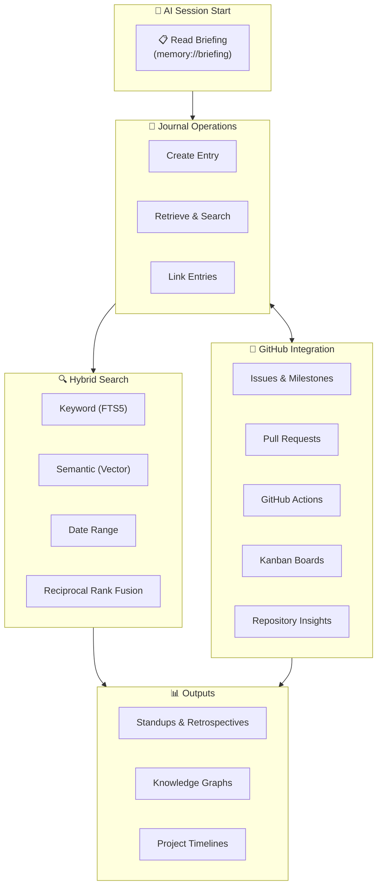

# Memory Journal MCP Server

<!-- mcp-name: io.github.neverinfamous/memory-journal-mcp -->

[](https://github.com/neverinfamous/memory-journal-mcp)
[](https://www.npmjs.com/package/memory-journal-mcp)
[](https://hub.docker.com/r/writenotenow/memory-journal-mcp)
[](https://opensource.org/licenses/MIT)

[](https://registry.modelcontextprotocol.io/v0/servers?search=io.github.neverinfamous/memory-journal-mcp)
[](SECURITY.md)
[](https://github.com/neverinfamous/memory-journal-mcp)


[](https://github.com/neverinfamous/memory-journal-mcp/actions/workflows/gatekeeper.yml)

🎯 **AI Context + Project Intelligence:** Bridge disconnected AI sessions with persistent project memory and **automatic session handoff** — with full GitHub workflow integration.

**[GitHub](https://github.com/neverinfamous/memory-journal-mcp)** • **[Wiki](https://github.com/neverinfamous/memory-journal-mcp/wiki)** • **[Changelog](https://github.com/neverinfamous/memory-journal-mcp/blob/main/CHANGELOG.md)** • **[Release Article](https://adamic.tech/articles/memory-journal-mcp-server)**

**🚀 Quick Deploy:**

- **[npm Package](https://www.npmjs.com/package/memory-journal-mcp)** - `npm install -g memory-journal-mcp`
- **[Docker Hub](https://hub.docker.com/r/writenotenow/memory-journal-mcp)** - Alpine-based with full semantic search

## 🎯 What This Does

### What Sets Us Apart

**65 MCP Tools** · **17 Workflow Prompts** · **38 Resources** · **10 Tool Groups** · **Code Mode** · **GitHub Commander** (Issue Triage, PR Review, Milestone Sprints, Security/Quality/Perf Audits) · **GitHub Integration** (Issues, PRs, Actions, Kanban, Milestones, Insights) · **Team Collaboration** (Shared DB, Vector Search, Cross-Project Insights)

| Feature                       | Description                                                                                                                                                    |
| ----------------------------- | -------------------------------------------------------------------------------------------------------------------------------------------------------------- |
| **Session Intelligence**      | Agents auto-query project history, create entries at checkpoints, and hand off context between sessions via `/session-summary` and `team-session-summary`      |
| **GitHub Integration**        | 16 tools for Issues, PRs, Actions, Kanban, Milestones (%), Copilot Reviews, and 14-day Insights                                                                |
| **Dynamic Project Routing**   | Seamlessly switch contexts and access CI/Issue tracking across multiple repositories using a single server instance via `PROJECT_REGISTRY`                     |
| **Knowledge Graphs**          | 8 relationship types linking specs → implementations → tests → PRs with Mermaid visualization                                                                  |
| **Hybrid Search**             | Reciprocal Rank Fusion combining FTS5 keywords, semantic vector similarity, auto-heuristics, and date-range filters                                            |
| **Code Mode**                 | Execute multi-step operations in a secure sandbox — up to 90% token savings via `mj.*` API                                                                     |
| **Configurable Briefing**     | 12 env vars / CLI flags control `memory://briefing` content — entries, team, GitHub detail, skills awareness                                                   |
| **Reports & Analytics**       | Standups, retrospectives, PR summaries, digests, period analyses, and milestone tracking                                                                       |
| **Team Collaboration**        | 22 tools with full parity — CRUD, vector search, relationship graphs, cross-project insights, author attribution                                               |
| **Data Interoperability**     | Bidirectional Markdown roundtripping, unified IO namespace, and schema-safe JSON exports with hard bounds-checked path traversal defenses                      |
| **Backup & Restore**          | One-command backup/restore with automated scheduling, retention policies, and safety-net auto-backups                                                          |
| **Security & Transport**      | OAuth 2.1 (RFC 9728/8414, JWT/JWKS, scopes), Streamable HTTP + SSE, rate limiting, CORS, SQL injection prevention, non-root Docker                             |
| **Structured Error Handling** | Every tool returns `{success, error, code, category, suggestion, recoverable}` — agents get classification, remediation hints, and recoverability signals      |
| **Agent Collaboration**       | IDE agents and Copilot share context; review findings become searchable knowledge; agents suggest reusable rules and skills ([setup](docs/copilot-setup.md))   |
| **GitHub Commander**          | Skills for issue triage, PR reviews, sprint milestones, and security/quality/performance audits with journal trails ([docs](skills/github-commander/SKILL.md)) |

---

## 🎯 Why Memory Journal?

When managing large projects with AI assistance, you face a critical challenge:

- **Thread Amnesia** - Each new AI conversation starts from zero, unaware of previous work
- **Lost Context** - Decisions, implementations, and learnings scattered across disconnected threads
- **Repeated Work** - AI suggests solutions you've already tried or abandoned
- **Context Overload** - Manually copying project history into every new conversation

Memory Journal solves this by acting as your project's **long-term memory**, bridging the gap between fragmented AI sessions.

---

**Ask Agent naturally:**

- "Show me my recent journal entries"
- "Create a backup of my journal"
- "Check the server health status"
- "Find entries related to performance"

**[See complete examples & prompts →](https://github.com/neverinfamous/memory-journal-mcp/wiki/Examples)**

---


```mermaid
flowchart TB
    subgraph Session["🤖 AI Session Start"]
        Briefing["📋 Read Briefing<br/>(memory://briefing)"]
    end

    subgraph Core["📝 Journal Operations"]
        Create["Create Entry"]
        Retrieve["Retrieve & Search"]
        Link["Link Entries"]
    end

    subgraph Search["🔍 Hybrid Search"]
        FTS["Keyword (FTS5)"]
        Semantic["Semantic (Vector)"]
        DateRange["Date Range"]
        RRF["Reciprocal Rank Fusion"]
    end

    subgraph GitHub["🐙 GitHub Integration"]
        Issues["Issues & Milestones"]
        PRs["Pull Requests"]
        Actions["GitHub Actions"]
        Kanban["Kanban Boards"]
        Insights["Repository Insights"]
    end

    subgraph Outputs["📊 Outputs"]
        Reports["Standups & Retrospectives"]
        Graphs["Knowledge Graphs"]
        Timeline["Project Timelines"]
    end

    Session --> Core
    Core --> Search
    Core <--> GitHub
    Search --> Outputs
    GitHub --> Outputs
```

---

Suggested Rule (Add to AGENTS.md, GEMINI.md, etc):

🛑 MANDATORY SESSION START ROUTINE

Execute BEFORE fulfilling any user request in a new session:

1. **TARGET**: Infer `repo_name` from the active workspace context or user prompt. If the task is not associated with a specific project, fallback to using the generic resource without a repo name (which defaults to the first registered workspace).
2. **FETCH**: Use the MCP `read_resource` tool (Server: `memory-journal-mcp`) to read `memory://briefing/{repo_name}` (or `memory://briefing` if falling back).
   - **RESTRICTION**: Do NOT use `execute_code` for this step.
3. **RENDER TABLE**: Extract `userMessage` and output it EXCLUSIVELY as a vertical Markdown Table (2 columns: Field and Value).
   - **RESTRICTION**: NO bulleted lists. NO truncation of arrays or lists.
   - **REQUIRED MAP**: Output all data comprehensively. Map these fields to the "Field" column:
     - Application / Project
     - Journal Entries
     - Team DB Entries
     - Latest Entry (Journal)
     - Latest Entry (Team)
     - GitHub (Include Repo, Branch, CI Status, Issues, PRs, Insights on separate lines in the Value column)
     - Milestone Progress
     - Template Resources (Output count only, not URLs)
     - Registered Workspaces (Output FULL list of project names)
     - Available Extensions (Rules, Skills, Workflows)

---

### Tool Filtering

> [!IMPORTANT]
> All shortcuts and tool groups include **Code Mode** (`mj_execute_code`) by default for token-efficient operations. To exclude it, add `-codemode` to your filter: `--tool-filter starter,-codemode`

Control which tools are exposed via `MEMORY_JOURNAL_MCP_TOOL_FILTER` (or CLI: `--tool-filter`):

| Filter               | Tools | Use Case                 |
| -------------------- | ----- | ------------------------ |
| `full`               | 65    | All tools (default)      |
| `starter`            | ~11   | Core + search + codemode |
| `essential`          | ~7    | Minimal footprint        |
| `readonly`           | ~15   | Disable all mutations    |
| `-github`            | 49    | Exclude a group          |
| `-github,-analytics` | 47    | Exclude multiple groups  |

**Filter Syntax:** `shortcut` or `group` or `tool_name` (whitelist mode) · `-group` (disable group) · `-tool` (disable tool) · `+tool` (re-enable after group disable)

**Custom Selection:** List individual tool names to create your own whitelist: `--tool-filter "create_entry,search_entries,semantic_search"`

**Groups:** `core`, `search`, `analytics`, `relationships`, `io`, `admin`, `github`, `backup`, `team`, `codemode`

**[Complete tool filtering guide →](https://github.com/neverinfamous/memory-journal-mcp/wiki/Tool-Filtering)**

---

## 📋 Core Capabilities

### 🛠️ **65 MCP Tools** (10 Groups)

| Group           | Tools | Description                                                                                                                              |
| --------------- | ----- | ---------------------------------------------------------------------------------------------------------------------------------------- |
| `codemode`      | 1     | Code Mode (sandboxed code execution) 🌟 **Recommended**                                                                                  |
| `core`          | 6     | Entry CRUD, tags, test                                                                                                                   |
| `search`        | 4     | Text search, date range, semantic, vector stats                                                                                          |
| `analytics`     | 2     | Statistics, cross-project insights                                                                                                       |
| `relationships` | 2     | Link entries, visualize graphs                                                                                                           |
| `io`            | 3     | JSON/Markdown export and File-level Markdown Data Integration Interoperability (Import/Export)                                           |
| `admin`         | 5     | Update, delete, rebuild/add to vector index, merge tags                                                                                  |
| `github`        | 16    | Issues, PRs, context, Kanban, **Milestones**, **Insights**, **issue lifecycle**, **Copilot Reviews**                                     |
| `backup`        | 4     | Backup, list, restore, cleanup                                                                                                           |
| `team`          | 22    | CRUD, search, stats, relationships, IO (Markdown import/export), backup, vector search, cross-project insights (requires `TEAM_DB_PATH`) |

**[Complete tools reference →](https://github.com/neverinfamous/memory-journal-mcp/wiki/Tools)**

### 🎯 **17 Workflow Prompts**

- `find-related` - Discover connected entries via semantic similarity
- `prepare-standup` - Daily standup summaries
- `prepare-retro` - Sprint retrospectives
- `weekly-digest` - Day-by-day weekly summaries
- `analyze-period` - Deep period analysis with insights
- `goal-tracker` - Milestone and achievement tracking
- `get-context-bundle` - Project context with Git/GitHub/Kanban
- `get-recent-entries` - Formatted recent entries
- `project-status-summary` - GitHub Project status reports
- `pr-summary` - Pull request journal activity summary
- `code-review-prep` - Comprehensive PR review preparation
- `pr-retrospective` - Completed PR analysis with learnings
- `actions-failure-digest` - CI/CD failure analysis
- `project-milestone-tracker` - Milestone progress tracking
- `confirm-briefing` - Acknowledge session context to user
- `session-summary` - Create a session summary entry with accomplishments, pending items, and next-session context
- `team-session-summary` - Create a retrospective team session summary entry securely isolated to the team database

**[Complete prompts guide →](https://github.com/neverinfamous/memory-journal-mcp/wiki/Prompts)**

### 📡 **38 Resources** (25 Static + 13 Template)

**Static Resources** (appear in resource lists):

- `memory://briefing` / `memory://briefing/{repo}` - **Session initialization**: compact context for AI agents (~300 tokens)
- `memory://instructions` - **Behavioral guidance**: complete server instructions for AI agents
- `memory://recent` - 10 most recent entries
- `memory://significant` - Significant milestones and breakthroughs
- `memory://graph/recent` - Live Mermaid diagram of recent relationships
- `memory://health` - Server health & diagnostics
- `memory://graph/actions` - CI/CD narrative graph
- `memory://actions/recent` - Recent workflow runs
- `memory://tags` - All tags with usage counts
- `memory://statistics` - Journal statistics
- `memory://rules` - User rules file content for agent awareness
- `memory://workflows` - Available agent workflows summary
- `memory://skills` - Agent skills index (names, paths, excerpts)
- `memory://github/status` - GitHub repository status overview
- `memory://github/insights` - Repository stars, forks, and 14-day traffic summary
- `memory://github/milestones` - Open milestones with completion percentages
- `memory://team/recent` - Recent team entries with author attribution
- `memory://team/statistics` - Team entry counts, types, and author breakdown
- `memory://help` - Tool group index with descriptions and tool counts
- `memory://help/gotchas` - Field notes, edge cases, and critical usage patterns
- `memory://metrics/summary` - Aggregate tool call metrics since server start (calls, errors, token estimates, duration) — HIGH priority
- `memory://metrics/tokens` - Per-tool token usage breakdown sorted by output token cost — MEDIUM priority
- `memory://metrics/system` - Process-level metrics: memory (MB), uptime (s), Node.js version, platform — MEDIUM priority
- `memory://metrics/users` - Per-user call counts (populated when OAuth user identifiers are present) — LOW priority
- `memory://audit` - Last 50 write/admin tool call entries from the JSONL audit log (requires `AUDIT_LOG_PATH`)

**Template Resources** (require parameters, fetch directly by URI):

- `memory://github/status/{repo}` - Repository status targeted by repo
- `memory://github/insights/{repo}` - Repository insights targeted by repo
- `memory://github/milestones/{repo}` - Open milestones targeted by repo
- `memory://milestones/{repo}/{number}` - Milestone detail targeted by repo
- `memory://projects/{number}/timeline` - Project activity timeline
- `memory://issues/{issue_number}/entries` - Entries linked to issue
- `memory://prs/{pr_number}/entries` - Entries linked to PR
- `memory://prs/{pr_number}/timeline` - Combined PR + journal timeline
- `memory://kanban/{project_number}` - GitHub Project Kanban board
- `memory://kanban/{project_number}/diagram` - Kanban Mermaid visualization
- `memory://milestones/{number}` - Milestone detail with completion progress
- `memory://help/{group}` - Per-group tool reference with parameters and annotations

---

## Code Mode: Maximum Efficiency

Code Mode (`mj_execute_code`) dramatically reduces token usage (70–90%) and is included by default in all presets.

Code executes in a **sandboxed VM context** with multiple layers of security. All `mj.*` API calls execute against the journal within the sandbox, providing:

- **Static code validation** — blocked patterns include `require()`, `process`, `eval()`, and filesystem access
- **Rate limiting** — 60 executions per minute per client
- **Hard timeouts** — configurable execution limit (default 30s)
- **Full API access** — all 10 tool groups are available via `mj.*` (e.g., `mj.core.createEntry()`, `mj.search.searchEntries()`, `mj.github.getGithubIssues()`, `mj.analytics.getStatistics()`)
- **Strict Readonly Contract** — Calling any mutation method under `--tool-filter readonly` safely halts the sandbox to prevent execution, returning a structured `{ success: false, error: "..." }` response to the agent instead of a raw MCP protocol exception.

### ⚡ Code Mode Only (Maximum Token Savings)

Run with **only Code Mode enabled** — a single tool that provides access to all 65 tools' worth of capability through the `mj.*` API:

```json
{
  "mcpServers": {
    "memory-journal-mcp": {
      "command": "memory-journal-mcp",
      "args": ["--tool-filter", "codemode"]
    }
  }
}
```

This exposes just `mj_execute_code`. The agent writes JavaScript against the typed `mj.*` SDK — composing operations across all 10 tool groups and returning exactly the data it needs — in one execution. This mirrors the [Code Mode pattern](https://blog.cloudflare.com/code-mode-mcp/) pioneered by Cloudflare for their entire API: fixed token cost regardless of how many capabilities exist.

#### Disabling Code Mode

If you prefer individual tool calls, exclude codemode:

```json
{
  "args": ["--tool-filter", "starter,-codemode"]
}
```

---

## 🚀 Quick Start

### Option 1: npm (Recommended)

```bash
npm install -g memory-journal-mcp
```

### Option 2: From Source

```bash
git clone https://github.com/neverinfamous/memory-journal-mcp.git
cd memory-journal-mcp
npm install
npm run build
```

### Add to MCP Config

Add this to your `~/.cursor/mcp.json`, Claude Desktop config, or equivalent:

### Basic Configuration

```json
{
  "mcpServers": {
    "memory-journal-mcp": {
      "command": "memory-journal-mcp",
      "env": {
        "GITHUB_TOKEN": "ghp_your_token_here",
        "PROJECT_REGISTRY": "{\"my-repo\":{\"path\":\"/path/to/your/git/repo\",\"project_number\":1}}"
      }
    }
  }
}
```

### Advanced Configuration (Recommended)

Showcasing the full power of the server, including Multi-Project Routing, Team Collaboration, Copilot awareness, and Context Injections.

```json
{
  "mcpServers": {
    "memory-journal-mcp": {
      "command": "memory-journal-mcp",
      "env": {
        "DB_PATH": "/path/to/your/memory_journal.db",
        "TEAM_DB_PATH": "/path/to/shared/team.db",
        "GITHUB_TOKEN": "ghp_your_token_here",
        "PROJECT_REGISTRY": "{\"my-repo\":{\"path\":\"/path/to/repo\",\"project_number\":1},\"other-repo\":{\"path\":\"/path/to/other\",\"project_number\":5}}",
        "AUTO_REBUILD_INDEX": "true",
        "MEMORY_JOURNAL_MCP_TOOL_FILTER": "codemode",
        "BRIEFING_ENTRY_COUNT": "3",
        "BRIEFING_INCLUDE_TEAM": "true",
        "BRIEFING_ISSUE_COUNT": "1",
        "BRIEFING_PR_COUNT": "1",
        "BRIEFING_PR_STATUS": "true",
        "BRIEFING_WORKFLOW_COUNT": "1",
        "BRIEFING_WORKFLOW_STATUS": "true",
        "BRIEFING_COPILOT_REVIEWS": "true",
        "RULES_FILE_PATH": "/path/to/your/RULES.md",
        "SKILLS_DIR_PATH": "/path/to/your/skills",
        "MEMORY_JOURNAL_WORKFLOW_SUMMARY": "/deploy: prod deployment | /audit: security scan"
      }
    }
  }
}
```

**Variants** (modify the config above):

| Variant                 | Change                                                                                                                       |
| ----------------------- | ---------------------------------------------------------------------------------------------------------------------------- |
| **Minimal (no GitHub)** | Remove the `env` block entirely                                                                                              |
| **npx (no install)**    | Replace `"command"` with `"npx"` and add `"args": ["-y", "memory-journal-mcp"]`                                              |
| **From source**         | Replace `"command"` with `"node"` and add `"args": ["dist/cli.js"]`                                                          |
| **Code Mode only**      | Add `"args": ["--tool-filter", "codemode"]` (single tool, all capabilities)                                                  |
| **Docker**              | Replace `"command"` with `"docker"` and use `run -i --rm -v ./data:/app/data writenotenow/memory-journal-mcp:latest` as args |
| **Team collaboration**  | Add `"TEAM_DB_PATH": "./team.db"` to `env`                                                                                   |

Restart your MCP client and start journaling!

### Option 3: HTTP/SSE Transport (Remote Access)

For remote access or web-based clients, run the server in HTTP mode:

```bash
memory-journal-mcp --transport http --port 3000
```

To bind to all interfaces (required for containers):

```bash
memory-journal-mcp --transport http --port 3000 --server-host 0.0.0.0
```

**Endpoints:**

| Endpoint                                    | Description                                      | Mode     |
| ------------------------------------------- | ------------------------------------------------ | -------- |
| `GET /`                                     | Server info and available endpoints              | Both     |
| `POST /mcp`                                 | JSON-RPC requests (initialize, tools/call, etc.) | Both     |
| `GET /mcp`                                  | SSE stream for server-to-client notifications    | Stateful |
| `DELETE /mcp`                               | Session termination                              | Stateful |
| `GET /sse`                                  | Legacy SSE connection (MCP 2024-11-05)           | Stateful |
| `POST /messages`                            | Legacy SSE message endpoint                      | Stateful |
| `GET /health`                               | Health check (`{ status, timestamp }`)           | Both     |
| `GET /.well-known/oauth-protected-resource` | RFC 9728 Protected Resource Metadata             | Both     |

**Session Management:** The server uses stateful sessions by default. Include the `mcp-session-id` header (returned from initialization) in subsequent requests.

- **OAuth 2.1** — RFC 9728/8414, JWT/JWKS, granular scopes (opt-in via `--oauth-enabled`)
- **7 Security Headers** — CSP, HSTS (opt-in), X-Frame-Options, and more
- **Rate Limiting** — 100 req/min per IP · **CORS** — configurable multi-origin (exact-match) · **1MB body limit**
- **Server Timeouts** — Request (120s), keep-alive (65s), headers (66s) · **404 handler** · **Cross-protocol guard**
- **Build Provenance** · **SBOM** · **Supply Chain Attestations** · **Non-root execution**

**Example with curl:**

Initialize session (returns `mcp-session-id` header):

```bash
curl -X POST http://localhost:3000/mcp \
  -H "Content-Type: application/json" \
  -H "Accept: application/json, text/event-stream" \
  -d '{"jsonrpc":"2.0","id":1,"method":"initialize","params":{"protocolVersion":"2025-03-26","capabilities":{},"clientInfo":{"name":"test","version":"1.0"}}}'
```

List tools (with session):

```bash
curl -X POST http://localhost:3000/mcp \
  -H "Content-Type: application/json" \
  -H "Accept: application/json, text/event-stream" \
  -H "mcp-session-id: YOUR_SESSION_ID" \
  -d '{"jsonrpc":"2.0","id":2,"method":"tools/list","params":{}}'
```

#### Stateless Mode (Serverless)

For serverless deployments (Lambda, Workers, Vercel), use stateless mode:

```bash
memory-journal-mcp --transport http --port 3000 --stateless
```

| Mode                      | Progress Notifications | Legacy SSE | Serverless |
| ------------------------- | ---------------------- | ---------- | ---------- |
| Stateful (default)        | ✅ Yes                 | ✅ Yes     | ⚠️ Complex |
| Stateless (`--stateless`) | ❌ No                  | ❌ No      | ✅ Native  |

#### Automated Scheduling (HTTP Only)

When running in HTTP/SSE mode, enable periodic maintenance jobs with CLI flags. These jobs run in-process on `setInterval` — no external cron needed.

> **Note:** These flags are ignored for stdio transport because stdio sessions are short-lived (tied to your IDE session). For stdio, use OS-level scheduling (Task Scheduler, cron) or run the backup/cleanup tools manually.

```bash
memory-journal-mcp --transport http --port 3000 \
  --backup-interval 60 --keep-backups 10 \
  --vacuum-interval 1440 \
  --rebuild-index-interval 720
```

| Flag                             | Default | Description                                                          |
| -------------------------------- | ------- | -------------------------------------------------------------------- |
| `--backup-interval <min>`        | 0 (off) | Create timestamped database backups and prune old ones automatically |
| `--keep-backups <count>`         | 5       | Max backups retained during automated cleanup                        |
| `--vacuum-interval <min>`        | 0 (off) | Run `PRAGMA optimize` and flush database to disk                     |
| `--rebuild-index-interval <min>` | 0 (off) | Full vector index rebuild to maintain semantic search quality        |

Each job is error-isolated — a failure in one job won't affect the others. Scheduler status (last run, result, next run) is visible via `memory://health`.

### GitHub Integration Configuration

The GitHub tools (`get_github_issues`, `get_github_prs`, etc.) auto-detect the repository from your git context when `PROJECT_REGISTRY` is configured or the MCP server is run inside a git repository.

| Environment Variable              | Description                                                                                                                 |
| --------------------------------- | --------------------------------------------------------------------------------------------------------------------------- |
| `DB_PATH`                         | Database file location (CLI: `--db`; default: `./memory_journal.db`)                                                        |
| `TEAM_DB_PATH`                    | Team database file location (CLI: `--team-db`)                                                                              |
| `TEAM_AUTHOR`                     | Override author name for team entries (default: `git config user.name`)                                                     |
| `GITHUB_TOKEN`                    | GitHub personal access token for API access                                                                                 |
| `DEFAULT_PROJECT_NUMBER`          | Default GitHub Project number for auto-assignment when creating issues                                                      |
| `PROJECT_REGISTRY`                | JSON map of repos to `{ path, project_number }` for multi-project auto-detection and routing                                |
| `AUTO_REBUILD_INDEX`              | Set to `true` to rebuild vector index on server startup                                                                     |
| `MCP_HOST`                        | Server bind host (`0.0.0.0` for containers, default: `localhost`)                                                           |
| `MCP_AUTH_TOKEN`                  | Bearer token for HTTP transport authentication (CLI: `--auth-token`)                                                        |
| `MCP_CORS_ORIGIN`                 | Allowed CORS origins for HTTP transport, comma-separated (default: `*`)                                                     |
| `MCP_RATE_LIMIT_MAX`              | Max requests per minute per client IP, HTTP only (default: `100`)                                                           |
| `LOG_LEVEL`                       | Log verbosity: `error`, `warn`, `info`, `debug` (default: `info`; CLI: `--log-level`)                                       |
| `MCP_ENABLE_HSTS`                 | Enable HSTS security header on HTTP responses (CLI: `--enable-hsts`; default: `false`)                                      |
| `OAUTH_ENABLED`                   | Set to `true` to enable OAuth 2.1 authentication (HTTP only)                                                                |
| `OAUTH_ISSUER`                    | OAuth issuer URL (e.g., `https://auth.example.com/realms/mcp`)                                                              |
| `OAUTH_AUDIENCE`                  | Expected JWT audience claim                                                                                                 |
| `OAUTH_JWKS_URI`                  | JWKS endpoint for token signature verification                                                                              |
| `BRIEFING_ENTRY_COUNT`            | Journal entries in briefing (CLI: `--briefing-entries`; default: `3`)                                                       |
| `BRIEFING_INCLUDE_TEAM`           | Include team DB entries in briefing (`true`/`false`; default: `false`)                                                      |
| `BRIEFING_ISSUE_COUNT`            | Issues to list in briefing; `0` = count only (default: `0`)                                                                 |
| `BRIEFING_PR_COUNT`               | PRs to list in briefing; `0` = count only (default: `0`)                                                                    |
| `BRIEFING_PR_STATUS`              | Show PR status breakdown (open/merged/closed; default: `false`)                                                             |
| `BRIEFING_MILESTONE_COUNT`        | Milestones to list in briefing; `0` = hide entirely (CLI: `--briefing-milestones`; default: `3`)                            |
| `BRIEFING_WORKFLOW_COUNT`         | Workflow runs to list in briefing; `0` = status only (default: `0`)                                                         |
| `BRIEFING_WORKFLOW_STATUS`        | Show workflow status breakdown in briefing (default: `false`)                                                               |
| `BRIEFING_COPILOT_REVIEWS`        | Aggregate Copilot review state in briefing (default: `false`)                                                               |
| `RULES_FILE_PATH`                 | Path to user rules file for agent awareness (CLI: `--rules-file`)                                                           |
| `SKILLS_DIR_PATH`                 | Path to skills directory for agent awareness (CLI: `--skills-dir`)                                                          |
| `MEMORY_JOURNAL_WORKFLOW_SUMMARY` | Free-text workflow summary for `memory://workflows` (CLI: `--workflow-summary`)                                             |
| `INSTRUCTION_LEVEL`               | Briefing depth: `essential`, `standard`, `full` (CLI: `--instruction-level`; default: `standard`)                           |
| `PROJECT_LINT_CMD`                | Project lint command for GitHub Commander validation gates (default: `npm run lint`)                                        |
| `PROJECT_TYPECHECK_CMD`           | Project typecheck command (default: `npm run typecheck`; empty = skip)                                                      |
| `PROJECT_BUILD_CMD`               | Project build command (default: `npm run build`; empty = skip)                                                              |
| `PROJECT_TEST_CMD`                | Project test command (default: `npm run test`)                                                                              |
| `PROJECT_E2E_CMD`                 | Project E2E test command (default: empty = skip)                                                                            |
| `PROJECT_PACKAGE_MANAGER`         | Package manager override: `npm`, `yarn`, `pnpm`, `bun` (default: auto-detect from lockfile)                                 |
| `PROJECT_HAS_DOCKERFILE`          | Enable Docker audit steps (default: auto-detect)                                                                            |
| `COMMANDER_HITL_FILE_THRESHOLD`   | Human-in-the-loop checkpoint if changes touch > N files (default: `10`)                                                     |
| `COMMANDER_SECURITY_TOOLS`        | Override security tool auto-detection (comma-separated; default: auto-detect)                                               |
| `COMMANDER_BRANCH_PREFIX`         | Branch naming prefix for PRs (default: `fix`)                                                                               |
| `AUDIT_LOG_PATH`                  | Path for the JSONL audit log of write/admin tool calls. Rotates at 10 MB (keeps 5 archives). Omit to disable audit logging. |
| `AUDIT_REDACT`                    | Set to `true` to omit tool arguments from audit log entries for privacy (default: `false`)                                  |
| `AUDIT_READS`                     | Log read-scoped tool calls in addition to write/admin (CLI: `--audit-reads`; default: `false`)                              |
| `AUDIT_LOG_MAX_SIZE`              | Maximum audit log file size in bytes before rotation (CLI: `--audit-log-max-size`; default: `10485760`)                     |
| `MCP_METRICS_ENABLED`             | Set to `false` to disable in-memory tool call metrics accumulation (default: `true`)                                        |

**Multi-Project Workflows**: For agents to seamlessly support multiple projects, provide **`PROJECT_REGISTRY`**.

#### Dynamic Context Resolution & Auto-Detection

When executing GitHub tools (issues, PRs, context, etc.), the server resolves repository context in this order:

1. **Dynamic Project Routing**: If the agent passes a `repo` string that matches a key in your `PROJECT_REGISTRY`, the server dynamically mounts the physical directory mapped to that project. It executes git commands locally and automatically infers the `owner`.
2. **Explicit Override**: If the agent provides both `owner` and `repo` explicitly, those values override auto-detection for API calls.
3. **Missing Context**: Without `PROJECT_REGISTRY` or explicit parameters, the server blocks execution and returns `{requiresUserInput: true}` to prompt the agent.

#### Automatic Project Routing (Kanban / Issues)

When opening an issue or viewing/moving a Kanban card, the server needs a GitHub Project number. It determines this via:

1. Exploring the raw `project_number` argument passed by the agent.
2. Checking if the `repo` string precisely matches an entry in your **`PROJECT_REGISTRY`**, seamlessly mapping it to its pre-configured `project_number`.
3. Falling back to the globally defined `DEFAULT_PROJECT_NUMBER` if set.

### 🔐 OAuth 2.1 Authentication

For production deployments, enable OAuth 2.1 authentication on the HTTP transport:

| Component                   | Status | Description                                      |
| --------------------------- | ------ | ------------------------------------------------ |
| Protected Resource Metadata | ✅     | RFC 9728 `/.well-known/oauth-protected-resource` |
| Auth Server Discovery       | ✅     | RFC 8414 metadata discovery with caching         |
| Token Validation            | ✅     | JWT validation with JWKS support                 |
| Scope Enforcement           | ✅     | Granular `read`, `write`, `admin` scopes         |
| HTTP Transport              | ✅     | Streamable HTTP with OAuth middleware            |

**Supported Scopes:**

| Scope   | Tool Groups                                       |
| ------- | ------------------------------------------------- |
| `read`  | core, search, analytics, relationships, io        |
| `write` | github, team (+ all read groups)                  |
| `admin` | admin, backup, codemode (+ all write/read groups) |

**Quick Start:**

```bash
memory-journal-mcp --transport http --port 3000 \
  --oauth-enabled \
  --oauth-issuer https://auth.example.com/realms/mcp \
  --oauth-audience memory-journal-mcp \
  --oauth-jwks-uri https://auth.example.com/realms/mcp/protocol/openid-connect/certs
```

Or via environment variables:

```bash
export OAUTH_ENABLED=true
export OAUTH_ISSUER=https://auth.example.com/realms/mcp
export OAUTH_AUDIENCE=memory-journal-mcp
memory-journal-mcp --transport http --port 3000
```

> **Note:** OAuth is opt-in. When not enabled, the server falls back to simple token authentication via `MCP_AUTH_TOKEN` environment variable, or runs without authentication.

### 🔄 Session Management

1. **Session start** → agent reads `memory://briefing` (or `memory://briefing/{repo}`) and shows project context
2. **Session summary** → use `/session-summary` to capture progress and next-session context
3. Next session's briefing includes the previous summary — context flows seamlessly

## 🔧 Configuration

### GitHub Integration (Optional)

```bash
export GITHUB_TOKEN="your_token"              # For Projects/Issues/PRs
```

**Scopes:** `repo`, `project`, `read:org` (org-level project discovery only)

### GitHub Management Capabilities

Memory Journal provides a **hybrid approach** to GitHub management:

| Capability Source  | Purpose                                                                                    |
| ------------------ | ------------------------------------------------------------------------------------------ |
| **MCP Server**     | Specialized features: Kanban visualization, Milestones, journal linking, project timelines |
| **Agent (gh CLI)** | Full GitHub mutations: create/close issues, create/merge PRs, manage releases              |

**MCP Server Tools (Read + Kanban + Milestones + Issue Lifecycle):**

- `get_github_issues` / `get_github_issue` - Query issues
- `get_github_prs` / `get_github_pr` - Query pull requests
- `get_github_context` - Full repository context
- `get_kanban_board` / `move_kanban_item` - **Kanban management**
- `get_github_milestones` / `get_github_milestone` - **Milestone tracking with completion %**
- `create_github_milestone` / `update_github_milestone` / `delete_github_milestone` - **Milestone CRUD**
- `get_repo_insights` - **Repository traffic & analytics** (stars, clones, views, referrers, popular paths)
- `create_github_issue_with_entry` / `close_github_issue_with_entry` - **Issue lifecycle with journal linking**

> **Why this design?** The MCP server focuses on value-added features that integrate journal entries with GitHub (Kanban views, Milestones, timeline resources, context linking). Standard GitHub mutations (create/close issues, merge PRs, manage releases) are handled directly by agents via `gh` CLI.

**[Complete GitHub integration guide →](https://github.com/neverinfamous/memory-journal-mcp/wiki/Git-Integration)**

## 🏗️ Architecture

### Data Flow


```mermaid
flowchart TB
    AI["🤖 AI Agent<br/>(Cursor, Windsurf, Claude)"]

    subgraph MCP["Memory Journal MCP Server"]
        Tools["🛠️ 65 Tools"]
        Resources["📡 38 Resources"]
        Prompts["💬 17 Prompts"]
    end

    subgraph Storage["Persistence Layer"]
        SQLite[("💾 SQLite<br/>Entries, Tags, Relationships")]
        Vector[("🔍 Vector Index<br/>Semantic Embeddings")]
        Backups["📦 Backups"]
    end

    subgraph External["External Integrations"]
        GitHub["🐙 GitHub API<br/>Issues, PRs, Actions"]
        Kanban["📋 Projects v2<br/>Kanban Boards"]
    end

    AI <-->|"MCP Protocol"| MCP
    Tools --> Storage
    Tools --> External
    Resources --> Storage
    Resources --> External
```

### Stack

```
┌─────────────────────────────────────────────────────────────┐
│ MCP Server Layer (TypeScript)                               │
│  ┌─────────────────┐  ┌─────────────────┐  ┌─────────────┐  │
│  │ Tools (65)      │  │ Resources (38)  │  │ Prompts (17)│  │
│  │ with Annotations│  │ with Annotations│  │             │  │
│  └─────────────────┘  └─────────────────┘  └─────────────┘  │
├─────────────────────────────────────────────────────────────┤
│ Native SQLite Engine                                        │
│  ┌─────────────────┐  ┌─────────────────┐  ┌─────────────┐  │
│  │ better-sqlite3  │  │ sqlite-vec      │  │ transformers│  │
│  │ (High-Perf I/O) │  │ (Vector Index)  │  │ (Embeddings)│  │
│  └─────────────────┘  └─────────────────┘  └─────────────┘  │
├─────────────────────────────────────────────────────────────┤
│ SQLite Database with Hybrid Search                          │
│  ┌─────────────────────────────────────────────────────────┐│
│  │ entries + tags + relationships + embeddings + backups   ││
│  └─────────────────────────────────────────────────────────┘│
└─────────────────────────────────────────────────────────────┘
```

---

## 🔧 Technical Highlights

### Performance & Portability

- **TypeScript + Native SQLite** - High-performance `better-sqlite3` with synchronous I/O
- **sqlite-vec** - Vector similarity search via SQLite extension
- **@huggingface/transformers** - ML embeddings in JavaScript
- **Lazy loading** - ML models load on first use, not startup

### Performance Benchmarks

Memory Journal is designed for extremely low overhead during AI task execution. We include a `vitest bench` suite to maintain these baseline guarantees:

- **Database Reads**: Operations execute in fractions of a millisecond. `calculateImportance` is ~13-14x faster than retrieving 50 recent entries.
- **Vector Search Engine**: Both search (~140-220 ops/sec) and indexing (~1600-1900+ ops/sec) are high-throughput via `sqlite-vec` with SQL-native KNN queries.
- **Core MCP Routines**: `getTools` uses cached O(1) dispatch (~4800-7000x faster than `get_recent_entries`). `create_entry` and `search_entries` execute through the full MCP layer with sub-millisecond overhead.

To run the benchmarking suite locally:

```bash
npm run bench
```

### Testing

Extensively tested across two frameworks:

| Suite                     | Command            | Covers                                                                          |
| ------------------------- | ------------------ | ------------------------------------------------------------------------------- |
| Vitest (unit/integration) | `npm test`         | Database, tools, resources, handlers, security, GitHub, vector search, codemode |
| Playwright (e2e)          | `npm run test:e2e` | HTTP/SSE transport, auth, sessions, CORS, security headers, scheduler           |

```bash
npm test          # Unit + integration tests
npm run test:e2e  # End-to-end HTTP/SSE transport tests
```

### Security

- **Deterministic error handling** - Every tool returns structured `{success, error, code, category, suggestion, recoverable}` responses with actionable context — no raw exceptions, no silent failures, no misleading messages
- **Local-first** - All data stored locally, no external API calls (except optional GitHub)
- **Input validation** - Zod schemas, content size limits, SQL injection prevention
- **Path traversal protection** - Backup filenames validated
- **MCP 2025-03-26 annotations** - Behavioral hints (`readOnlyHint`, `destructiveHint`, etc.)
- **HTTP transport hardening** - 7 security headers, configurable multi-origin CORS, 1MB body limit, built-in rate limiting (100 req/min), server timeouts, HSTS (opt-in), 30-min session timeout, 404 handler, cross-protocol guard
- **Token scrubbing** - GitHub tokens and credentials automatically redacted from error logs

### Data & Privacy

- **Single SQLite file** - You own your data
- **Portable** - Move your `.db` file anywhere
- **Soft delete** - Entries can be recovered
- **Auto-backup on restore** - Never lose data accidentally

---

## 📚 Documentation & Resources

- **[GitHub Wiki](https://github.com/neverinfamous/memory-journal-mcp/wiki)** - Complete documentation
- **[Copilot Setup Guide](docs/copilot-setup.md)** - Cross-agent memory bridge between IDE agents and GitHub Copilot
- **[Docker Hub](https://hub.docker.com/r/writenotenow/memory-journal-mcp)** - Container images
- **[npm Package](https://www.npmjs.com/package/memory-journal-mcp)** - Node.js distribution
- **[Issues](https://github.com/neverinfamous/memory-journal-mcp/issues)** - Bug reports & feature requests

---

## 📄 License

MIT License - See [LICENSE](LICENSE) file for details.

## 🤝 Contributing

Built by developers, for developers. PRs welcome! See [CONTRIBUTING.md](CONTRIBUTING.md) for guidelines.

---

_Migrating from v2.x?_ Your existing database is fully compatible. The TypeScript version uses the same schema and data format.
