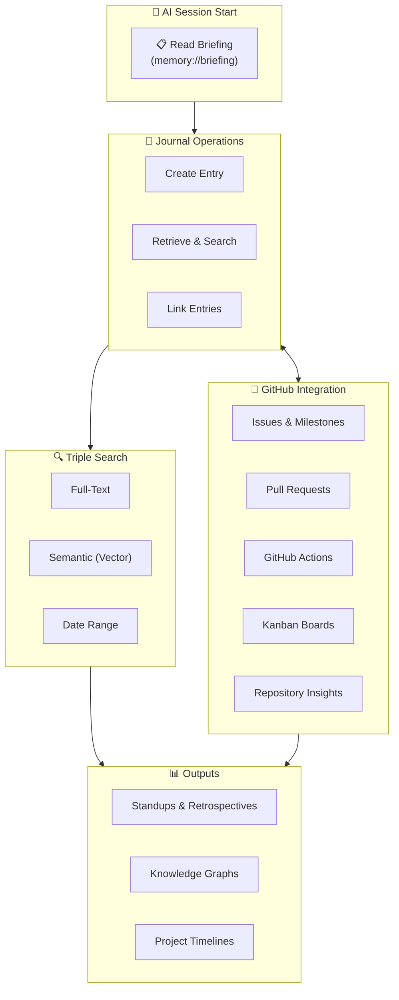
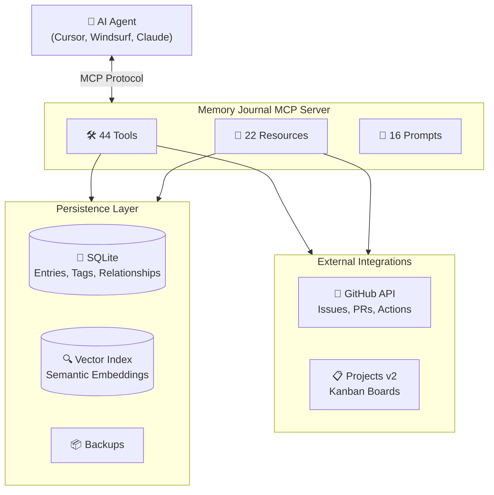

# Memory Journal MCP Server

<!-- mcp-name: io.github.neverinfamous/memory-journal-mcp -->

[](https://github.com/neverinfamous/memory-journal-mcp)
[](https://www.npmjs.com/package/memory-journal-mcp)
[](https://hub.docker.com/r/writenotenow/memory-journal-mcp)
[](https://opensource.org/licenses/MIT)

[](https://registry.modelcontextprotocol.io/v0/servers?search=io.github.neverinfamous/memory-journal-mcp)
[](SECURITY.md)
[](https://github.com/neverinfamous/memory-journal-mcp)


🎯 **AI Context + Project Intelligence:** Bridge disconnected AI sessions with persistent project memory and **automatic session handoff** — with full GitHub workflow integration.

**[GitHub](https://github.com/neverinfamous/memory-journal-mcp)** • **[Wiki](https://github.com/neverinfamous/memory-journal-mcp/wiki)** • **[Changelog](https://github.com/neverinfamous/memory-journal-mcp/blob/main/CHANGELOG.md)** • **[Release Article](https://adamic.tech/articles/memory-journal-mcp-server)**

**🚀 Quick Deploy:**

- **[npm Package](https://www.npmjs.com/package/memory-journal-mcp)** - `npm install -g memory-journal-mcp`
- **[Docker Hub](https://hub.docker.com/r/writenotenow/memory-journal-mcp)** - Alpine-based with full semantic search

## 🎯 What This Does

### What Sets Us Apart

**44 MCP Tools** · **16 Workflow Prompts** · **22 Resources** · **10 Tool Groups** · **Code Mode** · **GitHub Integration** (Issues, PRs, Actions, Kanban, Milestones, Insights)

| Feature                        | Description                                                                                                                                                                                                  |
| ------------------------------ | ------------------------------------------------------------------------------------------------------------------------------------------------------------------------------------------------------------ |
| **Dynamic Context Management** | AI agents automatically query your project history and create entries at the right moments — no manual copy-pasting between sessions                                                                         |
| **GitHub Integration**         | 16 tools covering Issues, PRs, Actions, Kanban boards, Milestones with completion %, Copilot Reviews, and 14-day repository Insights (stars, clones, views, referrers)                                       |
| **Knowledge Graphs**           | 8 relationship types linking specs → implementations → tests → PRs with automatic Mermaid visualization                                                                                                      |
| **Triple Search**              | Full-text (FTS5), semantic (AI-powered via `@huggingface/transformers` + `sqlite-vec`), and date-range search in one server                                                                                  |
| **Code Mode**                  | **Massive Token Savings:** Execute complex, multi-step operations inside a secure JavaScript sandbox — reducing token overhead by up to 90% while exposing all 44 capabilities via `mj.*` API                |
| **Configurable Briefing**      | 11 env vars / CLI flags to customize `memory://briefing` — control entry count, team inclusion, issue/PR/workflow detail level, Copilot review aggregation, and rules/skills awareness                       |
| **Session Continuity**         | A quick `/session-summary` captures progress and feeds it into the next session's briefing — context flows seamlessly across disconnected AI threads                                                         |
| **Reports & Analytics**        | Generate standups, retrospectives, PR summaries, weekly digests, period analyses, and milestone tracking from your journal data                                                                              |
| **Team Collaboration**         | Separate public team database with author attribution, cross-DB search, and dedicated team tools                                                                                                             |
| **Backup & Restore**           | One-command backup/restore with automated scheduling, retention policies, and auto-backup-on-restore safety net                                                                                              |
| **OAuth 2.1 + Access Control** | Enterprise-ready security with RFC 9728/8414 compliance, granular scopes (`read`, `write`, `admin`), JWT/JWKS validation, and Keycloak-compatible integration                                                |
| **HTTP Streaming Transport**   | Dual-protocol HTTP with Streamable HTTP + Legacy SSE, security headers, rate limiting, CORS, and stateless mode for serverless                                                                               |
| **Production-Ready Security**  | SQL injection prevention, input validation (Zod), path traversal protection, token scrubbing, 7 security headers, server timeouts, and non-root Docker execution                                             |
| **Structured Error Handling**  | Every tool returns rich `{success, error, code, category, suggestion, recoverable}` responses — no raw exceptions. Agents get error classification, actionable remediation hints, and recoverability signals |
| **Rule & Skill Suggestions**   | Agents offer to codify your recurring patterns into reusable rules and skills with your approval                                                                                                             |
| **Cross-Agent Memory**         | IDE agents and GitHub Copilot share context through journal entries — Copilot review findings become searchable knowledge, and IDE agents proactively apply past patterns ([setup guide](docs/copilot-setup.md)) |
| **Strict TypeScript**          | 100% type-safe codebase with strict mode, typed error classes, and no `eslint-disable` pragmas                                                                                                               |
| **MCP 2025-03-26 Compliant**   | Full protocol support with tool safety annotations, resource priorities, and progress notifications                                                                                                          |

---

## 🎯 Why Memory Journal?

When managing large projects with AI assistance, you face a critical challenge:

- **Thread Amnesia** - Each new AI conversation starts from zero, unaware of previous work
- **Lost Context** - Decisions, implementations, and learnings scattered across disconnected threads
- **Repeated Work** - AI suggests solutions you've already tried or abandoned
- **Context Overload** - Manually copying project history into every new conversation

Memory Journal solves this by acting as your project's **long-term memory**, bridging the gap between fragmented AI sessions.

---

**Ask Agent naturally:**

- "Show me my recent journal entries"
- "Create a backup of my journal"
- "Check the server health status"
- "Find entries related to performance"

**[See complete examples & prompts →](https://github.com/neverinfamous/memory-journal-mcp/wiki/Examples)**

---


```mermaid
flowchart TB
    subgraph Session["🤖 AI Session Start"]
        Briefing["📋 Read Briefing<br/>(memory://briefing)"]
    end

    subgraph Core["📝 Journal Operations"]
        Create["Create Entry"]
        Retrieve["Retrieve & Search"]
        Link["Link Entries"]
    end

    subgraph Search["🔍 Triple Search"]
        FTS["Full-Text"]
        Semantic["Semantic (Vector)"]
        DateRange["Date Range"]
    end

    subgraph GitHub["🐙 GitHub Integration"]
        Issues["Issues & Milestones"]
        PRs["Pull Requests"]
        Actions["GitHub Actions"]
        Kanban["Kanban Boards"]
        Insights["Repository Insights"]
    end

    subgraph Outputs["📊 Outputs"]
        Reports["Standups & Retrospectives"]
        Graphs["Knowledge Graphs"]
        Timeline["Project Timelines"]
    end

    Session --> Core
    Core --> Search
    Core <--> GitHub
    Search --> Outputs
    GitHub --> Outputs
```

---

## Rule (Add to AGENTS.md, GEMINI.md, etc)

### Session Initialization

When starting a session with this server, the agent **must** read the `memory://briefing` resource before processing the user's request. The briefing contains a `userMessage` property with project context that should be presented to the user at the start of each session.

**Steps:**

1. Use the `read_resource` tool to fetch `memory://briefing`
2. Parse the JSON response and present the `userMessage` content to the user
3. Proceed with the user's request

---

### Tool Filtering

> [!IMPORTANT]
> All shortcuts and tool groups include **Code Mode** (`mj_execute_code`) by default for token-efficient operations. To exclude it, add `-codemode` to your filter: `--tool-filter starter,-codemode`

Control which tools are exposed via `MEMORY_JOURNAL_MCP_TOOL_FILTER` (or CLI: `--tool-filter`):

| Filter               | Tools | Use Case                 |
| -------------------- | ----- | ------------------------ |
| `full`               | 44    | All tools (default)      |
| `starter`            | ~10   | Core + search + codemode |
| `essential`          | ~6    | Minimal footprint        |
| `readonly`           | ~15   | Disable all mutations    |
| `-github`            | 28    | Exclude a group          |
| `-github,-analytics` | 26    | Exclude multiple groups  |

**Filter Syntax:** `-group` (disable group) · `-tool` (disable tool) · `+tool` (re-enable after group disable)

**Groups:** `core`, `search`, `analytics`, `relationships`, `export`, `admin`, `github`, `backup`, `team`, `codemode`

**[Complete tool filtering guide →](https://github.com/neverinfamous/memory-journal-mcp/wiki/Tool-Filtering)**

---

## 📋 Core Capabilities

### 🛠️ **44 MCP Tools** (10 Groups)

| Group           | Tools | Description                                                                                          |
| --------------- | ----- | ---------------------------------------------------------------------------------------------------- |
| `codemode`      | 1     | Code Mode (sandboxed code execution) 🌟 **Recommended**                                              |
| `core`          | 6     | Entry CRUD, tags, test                                                                               |
| `search`        | 4     | Text search, date range, semantic, vector stats                                                      |
| `analytics`     | 2     | Statistics, cross-project insights                                                                   |
| `relationships` | 2     | Link entries, visualize graphs                                                                       |
| `export`        | 1     | JSON/Markdown export                                                                                 |
| `admin`         | 5     | Update, delete, rebuild/add to vector index, merge tags                                              |
| `github`        | 16    | Issues, PRs, context, Kanban, **Milestones**, **Insights**, **issue lifecycle**, **Copilot Reviews** |
| `backup`        | 4     | Backup, list, restore, cleanup                                                                       |
| `team`          | 3     | Team create, get recent, search (requires `TEAM_DB_PATH`)                                            |

**[Complete tools reference →](https://github.com/neverinfamous/memory-journal-mcp/wiki/Tools)**

### 🎯 **16 Workflow Prompts**

- `find-related` - Discover connected entries via semantic similarity
- `prepare-standup` - Daily standup summaries
- `prepare-retro` - Sprint retrospectives
- `weekly-digest` - Day-by-day weekly summaries
- `analyze-period` - Deep period analysis with insights
- `goal-tracker` - Milestone and achievement tracking
- `get-context-bundle` - Project context with Git/GitHub/Kanban
- `get-recent-entries` - Formatted recent entries
- `project-status-summary` - GitHub Project status reports
- `pr-summary` - Pull request journal activity summary
- `code-review-prep` - Comprehensive PR review preparation
- `pr-retrospective` - Completed PR analysis with learnings
- `actions-failure-digest` - CI/CD failure analysis
- `project-milestone-tracker` - Milestone progress tracking
- `confirm-briefing` - Acknowledge session context to user
- `session-summary` - Create a session summary entry with accomplishments, pending items, and next-session context

**[Complete prompts guide →](https://github.com/neverinfamous/memory-journal-mcp/wiki/Prompts)**

### 📡 **22 Resources** (15 Static + 7 Template)

**Static Resources** (appear in resource lists):

- `memory://briefing` - **Session initialization**: compact context for AI agents (~300 tokens)
- `memory://instructions` - **Behavioral guidance**: complete server instructions for AI agents
- `memory://recent` - 10 most recent entries
- `memory://significant` - Significant milestones and breakthroughs
- `memory://graph/recent` - Live Mermaid diagram of recent relationships
- `memory://health` - Server health & diagnostics
- `memory://graph/actions` - CI/CD narrative graph
- `memory://actions/recent` - Recent workflow runs
- `memory://tags` - All tags with usage counts
- `memory://statistics` - Journal statistics
- `memory://github/status` - GitHub repository status overview
- `memory://github/insights` - Repository stars, forks, and 14-day traffic summary
- `memory://github/milestones` - Open milestones with completion percentages
- `memory://team/recent` - Recent team entries with author attribution
- `memory://team/statistics` - Team entry counts, types, and author breakdown

**Template Resources** (require parameters, fetch directly by URI):

- `memory://projects/{number}/timeline` - Project activity timeline
- `memory://issues/{issue_number}/entries` - Entries linked to issue
- `memory://prs/{pr_number}/entries` - Entries linked to PR
- `memory://prs/{pr_number}/timeline` - Combined PR + journal timeline
- `memory://kanban/{project_number}` - GitHub Project Kanban board
- `memory://kanban/{project_number}/diagram` - Kanban Mermaid visualization
- `memory://milestones/{number}` - Milestone detail with completion progress

---

## Code Mode: Maximum Efficiency

Code Mode (`mj_execute_code`) dramatically reduces token usage (70–90%) and is included by default in all presets.

Code executes in a **sandboxed VM context** with multiple layers of security. All `mj.*` API calls execute against the journal within the sandbox, providing:

- **Static code validation** — blocked patterns include `require()`, `process`, `eval()`, and filesystem access
- **Rate limiting** — 60 executions per minute per client
- **Hard timeouts** — configurable execution limit (default 30s)
- **Full API access** — all 10 tool groups are available via `mj.*` (e.g., `mj.core.createEntry()`, `mj.search.searchEntries()`, `mj.github.getGithubIssues()`, `mj.analytics.getStatistics()`)

### ⚡ Code Mode Only (Maximum Token Savings)

Run with **only Code Mode enabled** — a single tool that provides access to all 44 tools' worth of capability through the `mj.*` API:

```json
{
  "mcpServers": {
    "memory-journal-mcp": {
      "command": "memory-journal-mcp",
      "args": ["--tool-filter", "codemode"]
    }
  }
}
```

This exposes just `mj_execute_code`. The agent writes JavaScript against the typed `mj.*` SDK — composing operations across all 10 tool groups and returning exactly the data it needs — in one execution. This mirrors the [Code Mode pattern](https://blog.cloudflare.com/code-mode-mcp/) pioneered by Cloudflare for their entire API: fixed token cost regardless of how many capabilities exist.

#### Disabling Code Mode

If you prefer individual tool calls, exclude codemode:

```json
{
  "args": ["--tool-filter", "starter,-codemode"]
}
```

---

## 🚀 Quick Start

### Option 1: npm (Recommended)

```bash
npm install -g memory-journal-mcp
```

### Option 2: From Source

```bash
git clone https://github.com/neverinfamous/memory-journal-mcp.git
cd memory-journal-mcp
npm install
npm run build
```

### Add to MCP Config

Add this to your `~/.cursor/mcp.json`, Claude Desktop config, or equivalent:

```json
{
  "mcpServers": {
    "memory-journal-mcp": {
      "command": "memory-journal-mcp",
      "env": {
        "GITHUB_TOKEN": "ghp_your_token_here",
        "GITHUB_REPO_PATH": "/path/to/your/git/repo"
      }
    }
  }
}
```

**Variants** (modify the config above):

| Variant                 | Change                                                                                                                       |
| ----------------------- | ---------------------------------------------------------------------------------------------------------------------------- |
| **Minimal (no GitHub)** | Remove the `env` block entirely                                                                                              |
| **npx (no install)**    | Replace `"command"` with `"npx"` and add `"args": ["-y", "memory-journal-mcp"]`                                              |
| **From source**         | Replace `"command"` with `"node"` and add `"args": ["dist/cli.js"]`                                                          |
| **Code Mode only**      | Add `"args": ["--tool-filter", "codemode"]` (single tool, all capabilities)                                                  |
| **Docker**              | Replace `"command"` with `"docker"` and use `run -i --rm -v ./data:/app/data writenotenow/memory-journal-mcp:latest` as args |
| **Team collaboration**  | Add `"TEAM_DB_PATH": "./team.db"` to `env`                                                                                   |

Restart your MCP client and start journaling!

### Option 3: HTTP/SSE Transport (Remote Access)

For remote access or web-based clients, run the server in HTTP mode:

```bash
memory-journal-mcp --transport http --port 3000
```

To bind to all interfaces (required for containers):

```bash
memory-journal-mcp --transport http --port 3000 --server-host 0.0.0.0
```

**Endpoints:**

| Endpoint                                    | Description                                      | Mode     |
| ------------------------------------------- | ------------------------------------------------ | -------- |
| `GET /`                                     | Server info and available endpoints              | Both     |
| `POST /mcp`                                 | JSON-RPC requests (initialize, tools/call, etc.) | Both     |
| `GET /mcp`                                  | SSE stream for server-to-client notifications    | Stateful |
| `DELETE /mcp`                               | Session termination                              | Stateful |
| `GET /sse`                                  | Legacy SSE connection (MCP 2024-11-05)           | Stateful |
| `POST /messages`                            | Legacy SSE message endpoint                      | Stateful |
| `GET /health`                               | Health check (`{ status, timestamp }`)           | Both     |
| `GET /.well-known/oauth-protected-resource` | RFC 9728 Protected Resource Metadata             | Both     |

**Session Management:** The server uses stateful sessions by default. Include the `mcp-session-id` header (returned from initialization) in subsequent requests.

**Security Features:**

- **OAuth 2.1 Authentication** — RFC 9728/8414 compliant with JWT validation, JWKS caching, and granular scope enforcement (opt-in via `--oauth-enabled`)
- **7 Security Headers** — `X-Content-Type-Options`, `X-Frame-Options`, `Content-Security-Policy`, `Cache-Control`, `Referrer-Policy`, `Permissions-Policy`, `Strict-Transport-Security` (opt-in)
- **Rate Limiting** — 100 requests/minute per IP with built-in sliding window (429 on excess)
- **CORS** — Configurable via `--cors-origin` or `MCP_CORS_ORIGIN` (default: `*`). Supports comma-separated multiple origins and wildcard subdomains (e.g., `*.example.com`)
- **Body Size Limit** — 1 MB maximum (configurable)
- **Server Timeouts** — Request (120s), keep-alive (65s), and headers (66s) timeouts for DoS mitigation
- **404 Handler** — Unknown paths return `{ error: "Not found" }`
- **Cross-Protocol Guard** — SSE session IDs rejected on `/mcp` and vice versa
- **Build Provenance** - Cryptographic proof of build process
- **SBOM Available** - Complete software bill of materials
- **Supply Chain Attestations** - Verifiable build integrity
- **Non-root Execution** - Minimal attack surface

**Example with curl:**

Initialize session (returns `mcp-session-id` header):

```bash
curl -X POST http://localhost:3000/mcp \
  -H "Content-Type: application/json" \
  -H "Accept: application/json, text/event-stream" \
  -d '{"jsonrpc":"2.0","id":1,"method":"initialize","params":{"protocolVersion":"2025-03-26","capabilities":{},"clientInfo":{"name":"test","version":"1.0"}}}'
```

List tools (with session):

```bash
curl -X POST http://localhost:3000/mcp \
  -H "Content-Type: application/json" \
  -H "Accept: application/json, text/event-stream" \
  -H "mcp-session-id: YOUR_SESSION_ID" \
  -d '{"jsonrpc":"2.0","id":2,"method":"tools/list","params":{}}'
```

#### Stateless Mode (Serverless)

For serverless deployments (Lambda, Workers, Vercel), use stateless mode:

```bash
memory-journal-mcp --transport http --port 3000 --stateless
```

| Mode                      | Progress Notifications | Legacy SSE | Serverless |
| ------------------------- | ---------------------- | ---------- | ---------- |
| Stateful (default)        | ✅ Yes                 | ✅ Yes     | ⚠️ Complex |
| Stateless (`--stateless`) | ❌ No                  | ❌ No      | ✅ Native  |

#### Automated Scheduling (HTTP Only)

When running in HTTP/SSE mode, enable periodic maintenance jobs with CLI flags. These jobs run in-process on `setInterval` — no external cron needed.

> **Note:** These flags are ignored for stdio transport because stdio sessions are short-lived (tied to your IDE session). For stdio, use OS-level scheduling (Task Scheduler, cron) or run the backup/cleanup tools manually.

```bash
memory-journal-mcp --transport http --port 3000 \
  --backup-interval 60 --keep-backups 10 \
  --vacuum-interval 1440 \
  --rebuild-index-interval 720
```

| Flag                             | Default | Description                                                          |
| -------------------------------- | ------- | -------------------------------------------------------------------- |
| `--backup-interval <min>`        | 0 (off) | Create timestamped database backups and prune old ones automatically |
| `--keep-backups <count>`         | 5       | Max backups retained during automated cleanup                        |
| `--vacuum-interval <min>`        | 0 (off) | Run `PRAGMA optimize` and flush database to disk                     |
| `--rebuild-index-interval <min>` | 0 (off) | Full vector index rebuild to maintain semantic search quality        |

Each job is error-isolated — a failure in one job won't affect the others. Scheduler status (last run, result, next run) is visible via `memory://health`.

### GitHub Integration Configuration

The GitHub tools (`get_github_issues`, `get_github_prs`, etc.) auto-detect the repository from your git context when `GITHUB_REPO_PATH` is configured (shown in the Quick Start config above).

| Environment Variable       | Description                                                             |
| -------------------------- | ----------------------------------------------------------------------- |
| `DB_PATH`                  | Database file location (CLI: `--db`; default: `./memory_journal.db`)    |
| `TEAM_DB_PATH`             | Team database file location (CLI: `--team-db`)                          |
| `TEAM_AUTHOR`              | Override author name for team entries (default: `git config user.name`) |
| `GITHUB_TOKEN`             | GitHub personal access token for API access                             |
| `GITHUB_REPO_PATH`         | Path to the git repository for auto-detecting owner/repo                |
| `DEFAULT_PROJECT_NUMBER`   | Default GitHub Project number for auto-assignment when creating issues  |
| `AUTO_REBUILD_INDEX`       | Set to `true` to rebuild vector index on server startup                 |
| `MCP_HOST`                 | Server bind host (`0.0.0.0` for containers, default: `localhost`)       |
| `OAUTH_ENABLED`            | Set to `true` to enable OAuth 2.1 authentication (HTTP only)            |
| `OAUTH_ISSUER`             | OAuth issuer URL (e.g., `https://auth.example.com/realms/mcp`)          |
| `OAUTH_AUDIENCE`           | Expected JWT audience claim                                             |
| `OAUTH_JWKS_URI`           | JWKS endpoint for token signature verification                          |
| `BRIEFING_ENTRY_COUNT`     | Journal entries in briefing (CLI: `--briefing-entries`; default: `3`)   |
| `BRIEFING_INCLUDE_TEAM`    | Include team DB entries in briefing (`true`/`false`; default: `false`)  |
| `BRIEFING_ISSUE_COUNT`     | Issues to list in briefing; `0` = count only (default: `0`)             |
| `BRIEFING_PR_COUNT`        | PRs to list in briefing; `0` = count only (default: `0`)                |
| `BRIEFING_PR_STATUS`       | Show PR status breakdown (open/merged/closed; default: `false`)         |
| `BRIEFING_WORKFLOW_COUNT`  | Workflow runs to list in briefing; `0` = status only (default: `0`)     |
| `BRIEFING_WORKFLOW_STATUS` | Show workflow status breakdown in briefing (default: `false`)           |
| `BRIEFING_COPILOT_REVIEWS` | Aggregate Copilot review state in briefing (default: `false`)           |
| `RULES_FILE_PATH`          | Path to user rules file for agent awareness (CLI: `--rules-file`)       |
| `SKILLS_DIR_PATH`          | Path to skills directory for agent awareness (CLI: `--skills-dir`)      |

**Without `GITHUB_REPO_PATH`**: You'll need to explicitly provide `owner` and `repo` parameters when calling GitHub tools.

#### Fallback Behavior

When GitHub tools cannot auto-detect repository information:

1. **With `GITHUB_REPO_PATH` set**: Tools auto-detect `owner` and `repo` from git remote URL
2. **Without `GITHUB_REPO_PATH`**: Tools return structured response with `requiresUserInput: true` and instructions to provide `owner` and `repo` parameters
3. **With explicit parameters**: Always preferred - specify `owner` and `repo` directly in tool calls

**Example response when auto-detection fails:**

```json
{
  "error": "Could not auto-detect repository",
  "requiresUserInput": true,
  "instruction": "Please provide owner and repo parameters"
}
```

### 🔐 OAuth 2.1 Authentication

For production deployments, enable OAuth 2.1 authentication on the HTTP transport:

| Component                   | Status | Description                                      |
| --------------------------- | ------ | ------------------------------------------------ |
| Protected Resource Metadata | ✅     | RFC 9728 `/.well-known/oauth-protected-resource` |
| Auth Server Discovery       | ✅     | RFC 8414 metadata discovery with caching         |
| Token Validation            | ✅     | JWT validation with JWKS support                 |
| Scope Enforcement           | ✅     | Granular `read`, `write`, `admin` scopes         |
| HTTP Transport              | ✅     | Streamable HTTP with OAuth middleware            |

**Supported Scopes:**

| Scope   | Tool Groups                                       |
| ------- | ------------------------------------------------- |
| `read`  | core, search, analytics, relationships, export    |
| `write` | github, team (+ all read groups)                  |
| `admin` | admin, backup, codemode (+ all write/read groups) |

**Quick Start:**

```bash
memory-journal-mcp --transport http --port 3000 \
  --oauth-enabled \
  --oauth-issuer https://auth.example.com/realms/mcp \
  --oauth-audience memory-journal-mcp \
  --oauth-jwks-uri https://auth.example.com/realms/mcp/protocol/openid-connect/certs
```

Or via environment variables:

```bash
export OAUTH_ENABLED=true
export OAUTH_ISSUER=https://auth.example.com/realms/mcp
export OAUTH_AUDIENCE=memory-journal-mcp
memory-journal-mcp --transport http --port 3000
```

> **Note:** OAuth is opt-in. When not enabled, the server falls back to simple token authentication via `MCP_AUTH_TOKEN` environment variable, or runs without authentication.

### 🔄 Session Management

Memory Journal bridges AI sessions with a three-step cycle:

1. **Session start** → agent reads `memory://briefing` and shows you a project context summary (automatic via server instructions)
2. **Session summary** → use the `session-summary` prompt to capture what was accomplished, what's pending, and context for the next session
3. Next session's briefing includes the previous summary — context flows seamlessly

## 🔧 Configuration

### GitHub Integration (Optional)

```bash
export GITHUB_TOKEN="your_token"              # For Projects/Issues/PRs
```

**Scopes:** `repo`, `project`, `read:org` (org-level project discovery only)

### GitHub Management Capabilities

Memory Journal provides a **hybrid approach** to GitHub management:

| Capability Source  | Purpose                                                                                    |
| ------------------ | ------------------------------------------------------------------------------------------ |
| **MCP Server**     | Specialized features: Kanban visualization, Milestones, journal linking, project timelines |
| **Agent (gh CLI)** | Full GitHub mutations: create/close issues, create/merge PRs, manage releases              |

**MCP Server Tools (Read + Kanban + Milestones + Issue Lifecycle):**

- `get_github_issues` / `get_github_issue` - Query issues
- `get_github_prs` / `get_github_pr` - Query pull requests
- `get_github_context` - Full repository context
- `get_kanban_board` / `move_kanban_item` - **Kanban management**
- `get_github_milestones` / `get_github_milestone` - **Milestone tracking with completion %**
- `create_github_milestone` / `update_github_milestone` / `delete_github_milestone` - **Milestone CRUD**
- `get_repo_insights` - **Repository traffic & analytics** (stars, clones, views, referrers, popular paths)
- `create_github_issue_with_entry` / `close_github_issue_with_entry` - **Issue lifecycle with journal linking**

> **Why this design?** The MCP server focuses on value-added features that integrate journal entries with GitHub (Kanban views, Milestones, timeline resources, context linking). Standard GitHub mutations (create/close issues, merge PRs, manage releases) are handled directly by agents via `gh` CLI.

**[Complete GitHub integration guide →](https://github.com/neverinfamous/memory-journal-mcp/wiki/Git-Integration)**

## 🏗️ Architecture

### Data Flow


```mermaid
flowchart TB
    AI["🤖 AI Agent<br/>(Cursor, Windsurf, Claude)"]

    subgraph MCP["Memory Journal MCP Server"]
        Tools["🛠️ 44 Tools"]
        Resources["📡 22 Resources"]
        Prompts["💬 16 Prompts"]
    end

    subgraph Storage["Persistence Layer"]
        SQLite[("💾 SQLite<br/>Entries, Tags, Relationships")]
        Vector[("🔍 Vector Index<br/>Semantic Embeddings")]
        Backups["📦 Backups"]
    end

    subgraph External["External Integrations"]
        GitHub["🐙 GitHub API<br/>Issues, PRs, Actions"]
        Kanban["📋 Projects v2<br/>Kanban Boards"]
    end

    AI <-->|"MCP Protocol"| MCP
    Tools --> Storage
    Tools --> External
    Resources --> Storage
    Resources --> External
```

### Stack

```
┌─────────────────────────────────────────────────────────────┐
│ MCP Server Layer (TypeScript)                               │
│  ┌─────────────────┐  ┌─────────────────┐  ┌─────────────┐  │
│  │ Tools (44)      │  │ Resources (22)  │  │ Prompts (16)│  │
│  │ with Annotations│  │ with Annotations│  │             │  │
│  └─────────────────┘  └─────────────────┘  └─────────────┘  │
├─────────────────────────────────────────────────────────────┤
│ Native SQLite Engine                                        │
│  ┌─────────────────┐  ┌─────────────────┐  ┌─────────────┐  │
│  │ better-sqlite3  │  │ sqlite-vec      │  │ transformers│  │
│  │ (High-Perf I/O) │  │ (Vector Index)  │  │ (Embeddings)│  │
│  └─────────────────┘  └─────────────────┘  └─────────────┘  │
├─────────────────────────────────────────────────────────────┤
│ SQLite Database with Hybrid Search                          │
│  ┌─────────────────────────────────────────────────────────┐│
│  │ entries + tags + relationships + embeddings + backups   ││
│  └─────────────────────────────────────────────────────────┘│
└─────────────────────────────────────────────────────────────┘
```

---

## 🔧 Technical Highlights

### Performance & Portability

- **TypeScript + Native SQLite** - High-performance `better-sqlite3` with synchronous I/O
- **sqlite-vec** - Vector similarity search via SQLite extension
- **@huggingface/transformers** - ML embeddings in JavaScript
- **Lazy loading** - ML models load on first use, not startup

### Performance Benchmarks

Memory Journal is designed for extremely low overhead during AI task execution. We include a `vitest bench` suite to maintain these baseline guarantees:

- **Database Reads**: Operations execute in fractions of a millisecond. `calculateImportance` is ~7x faster than retrieving 50 recent entries (composite index optimization narrows this gap by accelerating `getRecentEntries` ~4x).
- **Vector Search Engine**: Both search (780 ops/sec) and indexing (640 ops/sec) are high-throughput via `sqlite-vec` with SQL-native KNN queries.
- **Core MCP Routines**: `getTools` uses cached O(1) dispatch (~4800x faster than tool execution). `create_entry` and `search_entries` execute through the full MCP layer with sub-millisecond overhead.

To run the benchmarking suite locally:

```bash
npm run bench
```

### Testing

**910 tests** across two test frameworks:

| Suite                     | Tests | Command            | Covers                                                                          |
| ------------------------- | ----- | ------------------ | ------------------------------------------------------------------------------- |
| Vitest (unit/integration) | 839   | `npm test`         | Database, tools, resources, handlers, security, GitHub, vector search, codemode |
| Playwright (e2e)          | 71    | `npm run test:e2e` | HTTP/SSE transport, auth, sessions, CORS, security headers, scheduler           |

```bash
npm test          # Unit + integration tests
npm run test:e2e  # End-to-end HTTP/SSE transport tests
```

### Security

- **Deterministic error handling** - Every tool returns structured `{success, error, code, category, suggestion, recoverable}` responses with actionable context — no raw exceptions, no silent failures, no misleading messages
- **Local-first** - All data stored locally, no external API calls (except optional GitHub)
- **Input validation** - Zod schemas, content size limits, SQL injection prevention
- **Path traversal protection** - Backup filenames validated
- **MCP 2025-03-26 annotations** - Behavioral hints (`readOnlyHint`, `destructiveHint`, etc.)
- **HTTP transport hardening** - 7 security headers, configurable multi-origin CORS, 1MB body limit, built-in rate limiting (100 req/min), server timeouts, HSTS (opt-in), 30-min session timeout, 404 handler, cross-protocol guard
- **Token scrubbing** - GitHub tokens and credentials automatically redacted from error logs

### Data & Privacy

- **Single SQLite file** - You own your data
- **Portable** - Move your `.db` file anywhere
- **Soft delete** - Entries can be recovered
- **Auto-backup on restore** - Never lose data accidentally

---

## 📚 Documentation & Resources

- **[GitHub Wiki](https://github.com/neverinfamous/memory-journal-mcp/wiki)** - Complete documentation
- **[Copilot Setup Guide](docs/copilot-setup.md)** - Cross-agent memory bridge between IDE agents and GitHub Copilot
- **[Docker Hub](https://hub.docker.com/r/writenotenow/memory-journal-mcp)** - Container images
- **[npm Package](https://www.npmjs.com/package/memory-journal-mcp)** - Node.js distribution
- **[Issues](https://github.com/neverinfamous/memory-journal-mcp/issues)** - Bug reports & feature requests

---

## 📄 License

MIT License - See [LICENSE](LICENSE) file for details.

## 🤝 Contributing

Built by developers, for developers. PRs welcome! See [CONTRIBUTING.md](CONTRIBUTING.md) for guidelines.

---

_Migrating from v2.x?_ Your existing database is fully compatible. The TypeScript version uses the same schema and data format.
