# Memory Journal MCP Server

Last Updated January 11, 2026 - v3.0.0

<!-- mcp-name: io.github.neverinfamous/memory-journal-mcp -->

[](https://github.com/neverinfamous/memory-journal-mcp)
[](https://www.npmjs.com/package/memory-journal-mcp)
[](https://hub.docker.com/r/writenotenow/memory-journal-mcp)
[](https://opensource.org/licenses/MIT)


[](https://registry.modelcontextprotocol.io/v0/servers?search=io.github.neverinfamous/memory-journal-mcp)
[](SECURITY.md)
[](https://github.com/neverinfamous/memory-journal-mcp)

*Project context management for AI-assisted development - Bridge the gap between fragmented AI threads with persistent knowledge graphs and intelligent context recall*

**🎯 Solve the AI Context Problem:** When working with AI across multiple threads and sessions, context is lost. Memory Journal maintains a persistent, searchable record of your project work, decisions, and progress - making every AI conversation informed by your complete project history.

**[GitHub](https://github.com/neverinfamous/memory-journal-mcp)** • **[Wiki](https://github.com/neverinfamous/memory-journal-mcp/wiki)** • **[Changelog](https://github.com/neverinfamous/memory-journal-mcp/wiki/CHANGELOG)** • **[Release Article](https://adamic.tech/articles/memory-journal-mcp-server)**

**🚀 Quick Deploy:**
- **[npm Package](https://www.npmjs.com/package/memory-journal-mcp)** - `npm install -g memory-journal-mcp`
- **[Docker Hub](https://hub.docker.com/r/writenotenow/memory-journal-mcp)** - Alpine-based with full semantic search

### 💡 How It Works

```mermaid
flowchart LR
    subgraph Problem["❌ Without Memory Journal"]
        direction TB
        A1["Session 1<br/>Context Lost"] --> A2["Session 2<br/>Start Over"] --> A3["Session 3<br/>Repeat Work"]
    end
    
    subgraph Solution["✅ With Memory Journal"]
        direction TB
        B1["Session 1"] --> MJ[("📚 Memory<br/>Journal")]
        B2["Session 2"] --> MJ
        B3["Session 3"] --> MJ
        MJ --> |"Recall"| B1
        MJ --> |"Search"| B2
        MJ --> |"Context"| B3
    end
    
    Problem -.->|"Solve with"| Solution
```



> **AI sessions become cumulative, not repetitive.** Every insight, decision, and breakthrough is captured and instantly retrievable.

---

## ✨ What's New in v3.0.0 (December 28, 2025)

### 🚀 **Complete TypeScript Rewrite**

Memory Journal v3.0 is a ground-up rewrite in TypeScript, delivering:

- **Pure JS Stack** - No native compilation required (`sql.js` + `vectra` + `@xenova/transformers`)
- **Cross-Platform Portability** - Works on Windows, macOS, Linux without binary dependencies
- **Strict Type Safety** - Zero TypeScript errors, 100% strict mode compliance
- **Faster Startup** - Lazy ML loading with instant cold starts
- **MCP 2025-11-25 Compliance** - Full spec compliance with behavioral annotations

### 🗄️ **New: Backup & Restore Tools**

Never lose your journal data again:

| Tool | Description |
|------|-------------|
| `backup_journal` | Create timestamped database backups |
| `list_backups` | List all available backup files |
| `restore_backup` | Restore from any backup (with auto-backup before restore) |

```javascript
// Create a backup before major changes
backup_journal({ name: "before_migration" })
// → { success: true, filename: "before_migration.db", sizeBytes: 524288 }

// List available backups
list_backups()
// → { backups: [...], total: 3, backupsDirectory: "~/.memory-journal/backups" }

// Restore from backup (requires confirmation)
restore_backup({ filename: "before_migration.db", confirm: true })
// → { success: true, previousEntryCount: 50, newEntryCount: 42 }
```

### 📊 **New: Server Health Resource**

Get comprehensive server diagnostics via `memory://health`:

```json
{
  "database": {
    "path": "~/.memory-journal/memory_journal.db",
    "sizeBytes": 524288,
    "entryCount": 150,
    "deletedEntryCount": 5,
    "relationshipCount": 42,
    "tagCount": 28
  },
  "backups": {
    "directory": "~/.memory-journal/backups",
    "count": 3,
    "lastBackup": { "filename": "...", "createdAt": "...", "sizeBytes": 524288 }
  },
  "vectorIndex": {
    "available": true,
    "indexedEntries": 150,
    "modelName": "all-MiniLM-L6-v2"
  },
  "toolFilter": {
    "active": false,
    "enabledCount": 27,
    "totalCount": 27
  },
  "timestamp": "2025-12-28T05:47:00Z"
}
```

### 📈 **Current Capabilities**

- **29 MCP tools** - Complete development workflow + backup/restore + Kanban
- **14 workflow prompts** - Standups, retrospectives, PR workflows, CI/CD failure analysis
- **16 MCP resources** - Including Kanban board views and Mermaid diagrams
- **GitHub Integration** - Projects, Issues, Pull Requests, Actions, **Kanban boards**
- **8 tool groups** - `core`, `search`, `analytics`, `relationships`, `export`, `admin`, `github`, `backup`
- **Knowledge graphs** - 5 relationship types, Mermaid visualization
- **Semantic search** - AI-powered conceptual search via `@xenova/transformers`

---

## 🎯 Why Memory Journal?

### **The Fragmented AI Context Problem**

When managing large projects with AI assistance, you face a critical challenge:

- **Thread Amnesia** - Each new AI conversation starts from zero, unaware of previous work
- **Lost Context** - Decisions, implementations, and learnings scattered across disconnected threads  
- **Repeated Work** - AI suggests solutions you've already tried or abandoned
- **Context Overload** - Manually copying project history into every new conversation

### **The Solution: Persistent Project Memory**

Memory Journal acts as your project's **long-term memory**, bridging the gap between fragmented AI threads:

**For Developers:**
- 📝 **Automatic Context Capture** - Git commits, branches, GitHub issues, PRs, and project state captured with every entry
- 🔗 **Knowledge Graph** - Link related work (specs → implementations → tests → PRs) to build a connected history
- 🔍 **Intelligent Search** - Find past decisions, solutions, and context across your entire project timeline
- 📊 **Project Analytics** - Track progress from issues through PRs, generate reports for standups/retrospectives

**For AI-Assisted Work:**
- 💡 AI can query your **complete project history** in any conversation
- 🧠 **Semantic search** finds conceptually related work, even without exact keywords
- 📖 **Context bundles** provide AI with comprehensive project state instantly
- 🔗 **Relationship visualization** shows how different pieces of work connect

---

## 🚀 Quick Start

### Option 1: npm (Recommended)

**Step 1: Install the package**

```bash
npm install -g memory-journal-mcp
```

**Step 2: Add to ~/.cursor/mcp.json**

```json
{
  "mcpServers": {
    "memory-journal-mcp": {
      "command": "memory-journal-mcp"
    }
  }
}
```

**Step 3: Restart Cursor**

Restart Cursor or your MCP client, then start journaling!

### Option 2: npx (No Installation)

```json
{
  "mcpServers": {
    "memory-journal-mcp": {
      "command": "npx",
      "args": ["-y", "memory-journal-mcp"]
    }
  }
}
```

### Option 3: From Source

```bash
git clone https://github.com/neverinfamous/memory-journal-mcp.git
cd memory-journal-mcp
npm install
npm run build
```

```json
{
  "mcpServers": {
    "memory-journal-mcp": {
      "command": "node",
      "args": ["dist/cli.js"]
    }
  }
}
```

### GitHub Integration Configuration

The GitHub tools (`get_github_issues`, `get_github_prs`, etc.) can auto-detect the repository from your git context. However, MCP clients may run the server from a different directory than your project.

**To enable GitHub auto-detection**, add `GITHUB_REPO_PATH` to your config:

```json
{
  "mcpServers": {
    "memory-journal-mcp": {
      "command": "memory-journal-mcp",
      "env": {
        "GITHUB_TOKEN": "ghp_your_token_here",
        "GITHUB_REPO_PATH": "/path/to/your/git/repo"
      }
    }
  }
}
```

| Environment Variable | Description |
|---------------------|-------------|
| `GITHUB_TOKEN` | GitHub personal access token for API access |
| `GITHUB_REPO_PATH` | Path to the git repository for auto-detecting owner/repo |

**Without `GITHUB_REPO_PATH`**: You'll need to explicitly provide `owner` and `repo` parameters when calling GitHub tools.

### Cursor Known Issues

**Listing MCP Resources**: If the agent has trouble listing resources, instruct it to call `list_mcp_resources()` without specifying a server parameter. Using `server="memory-journal-mcp"` may return nothing (Cursor bug).

---

## 📋 Core Capabilities

### 🛠️ **29 MCP Tools** (8 Groups)

| Group | Tools | Description |
|-------|-------|-------------|
| `core` | 6 | Entry CRUD, tags, test |
| `search` | 4 | Text search, date range, semantic, vector stats |
| `analytics` | 2 | Statistics, cross-project insights |
| `relationships` | 2 | Link entries, visualize graphs |
| `export` | 1 | JSON/Markdown export |
| `admin` | 4 | Update, delete, rebuild/add to vector index |
| `github` | 7 | Issues, PRs, context, **Kanban board** |
| `backup` | 3 | Backup, list, restore |

**[Complete tools reference →](https://github.com/neverinfamous/memory-journal-mcp/wiki/Tools)**

### 🎯 **14 Workflow Prompts**

- `find-related` - Discover connected entries via semantic similarity
- `prepare-standup` - Daily standup summaries
- `prepare-retro` - Sprint retrospectives
- `weekly-digest` - Day-by-day weekly summaries
- `analyze-period` - Deep period analysis with insights
- `goal-tracker` - Milestone and achievement tracking
- `get-context-bundle` - Project context with Git/GitHub/Kanban
- `pr-summary` - Pull request journal activity summary
- `code-review-prep` - Comprehensive PR review preparation
- `pr-retrospective` - Completed PR analysis with learnings
- `actions-failure-digest` - CI/CD failure analysis

**[Complete prompts guide →](https://github.com/neverinfamous/memory-journal-mcp/wiki/Prompts)**

### 📡 **16 Resources**

- `memory://recent` - 10 most recent entries
- `memory://significant` - Significant milestones and breakthroughs
- `memory://graph/recent` - Live Mermaid diagram of recent relationships
- `memory://team/recent` - Recent team-shared entries
- `memory://health` - Server health & diagnostics
- `memory://projects/{number}/timeline` - Project activity timeline
- `memory://issues/{issue_number}/entries` - Entries linked to issue
- `memory://prs/{pr_number}/entries` - Entries linked to PR
- `memory://prs/{pr_number}/timeline` - Combined PR + journal timeline
- `memory://graph/actions` - CI/CD narrative graph
- `memory://actions/recent` - Recent workflow runs
- `memory://tags` - All tags with usage counts
- `memory://statistics` - Journal statistics
- `memory://kanban/{project_number}` - **NEW** GitHub Project Kanban board
- `memory://kanban/{project_number}/diagram` - **NEW** Kanban Mermaid visualization

---

## 🔧 Configuration

### GitHub Integration (Optional)

```bash
export GITHUB_TOKEN="your_token"              # For Projects/Issues/PRs
export GITHUB_ORG_TOKEN="your_org_token"      # Optional: org projects
export DEFAULT_ORG="your-org-name"            # Optional: default org
```

**Scopes:** `repo`, `project`, `read:org` (org only)

### Tool Filtering (Optional)

Control which tools are exposed using `MEMORY_JOURNAL_MCP_TOOL_FILTER`:

```bash
export MEMORY_JOURNAL_MCP_TOOL_FILTER="-analytics,-github"
```

**Filter Syntax:**
- `-group` - Disable all tools in a group
- `-tool` - Disable a specific tool
- `+tool` - Re-enable after group disable
- Meta-groups: `starter`, `essential`, `full`, `readonly`

**Example Configurations:**

```json
{
  "mcpServers": {
    "memory-journal-mcp": {
      "command": "memory-journal-mcp",
      "env": {
        "MEMORY_JOURNAL_MCP_TOOL_FILTER": "starter",
        "GITHUB_TOKEN": "your_token"
      }
    }
  }
}
```

| Configuration | Filter String | Tools |
|---------------|---------------|-------|
| Starter | `starter` | ~10 |
| Essential | `essential` | ~6 |
| Full (default) | `full` | 27 |
| Read-only | `readonly` | ~20 |

**[Complete tool filtering guide →](https://github.com/neverinfamous/memory-journal-mcp/wiki/Tool-Filtering)**

---

## 📖 Usage Examples

### Create an Entry with GitHub Context

```javascript
create_entry({
  content: "Completed Phase 1 of GitHub Projects integration!",
  entry_type: "technical_achievement",
  tags: ["github-projects", "milestone"],
  project_number: 1,
  significance_type: "technical_breakthrough"
})
```

### Create and Manage Backups

```javascript
// Before major refactoring
backup_journal({ name: "pre_refactor" })

// Check available backups
list_backups()

// Restore if needed (creates auto-backup first)
restore_backup({ filename: "pre_refactor.db", confirm: true })
```

### Check Server Health

```javascript
// Fetch the health resource
// Returns: database stats, backup info, vector index status, tool filter config
```

### View and Manage Kanban Board

```javascript
// View Kanban board with items grouped by Status
get_kanban_board({ project_number: 5 })
// → { columns: [{ status: "Todo", items: [...] }, { status: "In Progress", items: [...] }], ... }

// Move an item to a different column
move_kanban_item({
  project_number: 5,
  item_id: "PVTI_...",
  target_status: "Done"
})
// → { success: true, message: 'Item moved to "Done"' }
```

### Search and Analyze

```javascript
// Full-text search
search_entries({ query: "performance optimization", limit: 5 })

// Semantic search for concepts
semantic_search({ query: "startup time improvements", limit: 3 })

// Get analytics
get_statistics({ group_by: "week" })
```

### Generate Visual Maps

```javascript
// Visualize entry relationships
visualize_relationships({
  entry_id: 55,
  depth: 2
})
```

---

## 🏗️ Architecture

### Data Flow

```mermaid
flowchart TB
    AI["🤖 AI Agent<br/>(Cursor, Windsurf, Claude)"]
    
    subgraph MCP["Memory Journal MCP Server"]
        Tools["🛠️ 29 Tools"]
        Resources["📡 16 Resources"]
        Prompts["💬 14 Prompts"]
    end
    
    subgraph Storage["Persistence Layer"]
        SQLite[("💾 SQLite<br/>Entries, Tags, Relationships")]
        Vector[("🔍 Vector Index<br/>Semantic Embeddings")]
        Backups["📦 Backups"]
    end
    
    subgraph External["External Integrations"]
        GitHub["🐙 GitHub API<br/>Issues, PRs, Actions"]
        Kanban["📋 Projects v2<br/>Kanban Boards"]
    end
    
    AI <-->|"MCP Protocol"| MCP
    Tools --> Storage
    Tools --> External
    Resources --> Storage
    Resources --> External
```



### Stack

```
┌─────────────────────────────────────────────────────────────┐
│ MCP Server Layer (TypeScript)                               │
│  ┌─────────────────┐  ┌─────────────────┐  ┌─────────────┐  │
│  │ Tools (29)      │  │ Resources (16)  │  │ Prompts (14)│  │
│  │ with Annotations│  │ with Annotations│  │             │  │
│  └─────────────────┘  └─────────────────┘  └─────────────┘  │
├─────────────────────────────────────────────────────────────┤
│ Pure JS Stack (No Native Dependencies)                      │
│  ┌─────────────────┐  ┌─────────────────┐  ┌─────────────┐  │
│  │ sql.js          │  │ vectra          │  │ transformers│  │
│  │ (SQLite)        │  │ (Vector Index)  │  │ (Embeddings)│  │
│  └─────────────────┘  └─────────────────┘  └─────────────┘  │
├─────────────────────────────────────────────────────────────┤
│ SQLite Database with Hybrid Search                          │
│  ┌─────────────────────────────────────────────────────────┐│
│  │ entries + tags + relationships + embeddings + backups   ││
│  └─────────────────────────────────────────────────────────┘│
└─────────────────────────────────────────────────────────────┘
```

---

## 🔧 Technical Highlights

### Performance & Portability
- **TypeScript + Pure JS Stack** - No native compilation, works everywhere
- **sql.js** - SQLite in pure JavaScript with disk sync
- **vectra** - Vector similarity search without native dependencies
- **@xenova/transformers** - ML embeddings in JavaScript
- **Lazy loading** - ML models load on first use, not startup

### Security
- **Local-first** - All data stored locally, no external API calls (except optional GitHub)
- **Input validation** - Zod schemas, content size limits, SQL injection prevention
- **Path traversal protection** - Backup filenames validated
- **MCP 2025-11-25 annotations** - Behavioral hints (`readOnlyHint`, `destructiveHint`, etc.)

### Data & Privacy
- **Single SQLite file** - You own your data
- **Portable** - Move your `.db` file anywhere
- **Soft delete** - Entries can be recovered
- **Auto-backup on restore** - Never lose data accidentally

---

## 📚 Documentation & Resources

- **[GitHub Wiki](https://github.com/neverinfamous/memory-journal-mcp/wiki)** - Complete documentation
- **[Docker Hub](https://hub.docker.com/r/writenotenow/memory-journal-mcp)** - Container images
- **[npm Package](https://www.npmjs.com/package/memory-journal-mcp)** - Node.js distribution
- **[Issues](https://github.com/neverinfamous/memory-journal-mcp/issues)** - Bug reports & feature requests

---

## 📄 License

MIT License - See [LICENSE](LICENSE) file for details.

## 🤝 Contributing

Built by developers, for developers. PRs welcome! See [CONTRIBUTING.md](CONTRIBUTING.md) for guidelines.

---

*Migrating from v2.x?* Your existing database is fully compatible. The TypeScript version uses the same schema and data format.
