# Memory Journal MCP Server

**Last Updated February 13, 2026**

<!-- mcp-name: io.github.neverinfamous/memory-journal-mcp -->

[](https://github.com/neverinfamous/memory-journal-mcp)
[](https://www.npmjs.com/package/memory-journal-mcp)
[](https://hub.docker.com/r/writenotenow/memory-journal-mcp)
[](https://opensource.org/licenses/MIT)

[](https://registry.modelcontextprotocol.io/v0/servers?search=io.github.neverinfamous/memory-journal-mcp)
[](SECURITY.md)
[](https://github.com/neverinfamous/memory-journal-mcp)

🎯 **AI Context + Project Intelligence:** Bridge disconnected AI sessions with persistent project memory, while integrating your complete GitHub workflow — Issues, PRs, Actions, Kanban boards, and knowledge graphs — into every conversation.

**[GitHub](https://github.com/neverinfamous/memory-journal-mcp)** • **[Wiki](https://github.com/neverinfamous/memory-journal-mcp/wiki)** • **[Changelog](https://github.com/neverinfamous/memory-journal-mcp/wiki/CHANGELOG)** • **[Release Article](https://adamic.tech/articles/memory-journal-mcp-server)**

**🚀 Quick Deploy:**

- **[npm Package](https://www.npmjs.com/package/memory-journal-mcp)** - `npm install -g memory-journal-mcp`
- **[Docker Hub](https://hub.docker.com/r/writenotenow/memory-journal-mcp)** - Alpine-based with full semantic search

## 🎯 What This Does

### Key Benefits

- 🧠 **Dynamic Context Management** - AI agents automatically query your project history and create entries at the right moments
- 📝 **Auto-capture Git/GitHub context** (commits, branches, issues, PRs, projects)
- 🔗 **Build knowledge graphs** linking specs → implementations → tests → PRs
- 🔍 **Triple search** (full-text, semantic, date range)
- 📊 **Generate reports** (standups, retrospectives, PR summaries, status)
- 🗄️ **Backup & restore** your journal data with one command

```mermaid
flowchart TB
    subgraph Session["🤖 AI Session Start"]
        Briefing["📋 Read Briefing<br/>(memory://briefing)"]
    end

    subgraph Core["📝 Journal Operations"]
        Create["Create Entry"]
        Retrieve["Retrieve & Search"]
        Link["Link Entries"]
    end

    subgraph Search["🔍 Triple Search"]
        FTS["Full-Text (FTS5)"]
        Semantic["Semantic (Vector)"]
        DateRange["Date Range"]
    end

    subgraph GitHub["🐙 GitHub Integration"]
        Issues["Issues & Milestones"]
        PRs["Pull Requests"]
        Actions["GitHub Actions"]
        Kanban["Kanban Boards"]
    end

    subgraph Outputs["📊 Outputs"]
        Reports["Standups & Retrospectives"]
        Graphs["Knowledge Graphs"]
        Timeline["Project Timelines"]
    end

    Session --> Core
    Core --> Search
    Core <--> GitHub
    Search --> Outputs
    GitHub --> Outputs
```



### 📈 **Current Capabilities**

- **33 MCP tools** - Complete development workflow + backup/restore + Kanban + issue management
- **15 workflow prompts** - Standups, retrospectives, PR workflows, CI/CD failure analysis, session acknowledgment
- **18 MCP resources** - 12 static + 6 template (require parameters)
- **GitHub Integration** - Projects, Issues, Pull Requests, Actions, **Kanban boards**
- **8 tool groups** - `core`, `search`, `analytics`, `relationships`, `export`, `admin`, `github`, `backup`
- **Knowledge graphs** - 8 relationship types, Mermaid visualization
- **Semantic search** - AI-powered conceptual search via `@xenova/transformers`

---

## 🎯 Why Memory Journal?

### **The Fragmented AI Context Problem**

When managing large projects with AI assistance, you face a critical challenge:

- **Thread Amnesia** - Each new AI conversation starts from zero, unaware of previous work
- **Lost Context** - Decisions, implementations, and learnings scattered across disconnected threads
- **Repeated Work** - AI suggests solutions you've already tried or abandoned
- **Context Overload** - Manually copying project history into every new conversation

### **The Solution: Persistent Project Memory**

Memory Journal acts as your project's **long-term memory**, bridging the gap between fragmented AI threads:

**For Developers:**

- 📝 **Automatic Context Capture** - Git commits, branches, GitHub issues, PRs, and project state captured with every entry
- 🔗 **Knowledge Graph** - Link related work (specs → implementations → tests → PRs) to build a connected history
- 🔍 **Intelligent Search** - Find past decisions, solutions, and context across your entire project timeline
- 📊 **Project Analytics** - Track progress from issues through PRs, generate reports for standups/retrospectives

**For AI-Assisted Work:**

- 🧠 **Dynamic Context Management** - Built-in guidance teaches AI agents when to query your project history and when to create entries
- 💡 AI can query your **complete project history** in any conversation
- 🔍 **Semantic search** finds conceptually related work, even without exact keywords
- 📖 **Context bundles** provide AI with comprehensive project state instantly
- 🔗 **Relationship visualization** shows how different pieces of work connect

---

## 🚀 Quick Start

### Option 1: npm (Recommended)

**Step 1: Install the package**

```bash
npm install -g memory-journal-mcp
```

**Step 2: Add to ~/.cursor/mcp.json**

```json
{
  "mcpServers": {
    "memory-journal-mcp": {
      "command": "memory-journal-mcp"
    }
  }
}
```

**Step 3: Restart Cursor**

Restart Cursor or your MCP client, then start journaling!

### Option 2: npx (No Installation)

```json
{
  "mcpServers": {
    "memory-journal-mcp": {
      "command": "npx",
      "args": ["-y", "memory-journal-mcp"]
    }
  }
}
```

### Option 3: From Source

```bash
git clone https://github.com/neverinfamous/memory-journal-mcp.git
cd memory-journal-mcp
npm install
npm run build
```

```json
{
  "mcpServers": {
    "memory-journal-mcp": {
      "command": "node",
      "args": ["dist/cli.js", "--default-project", "1"]
    }
  }
}
```

### Option 4: HTTP/SSE Transport (Remote Access)

For remote access or web-based clients, run the server in HTTP mode:

```bash
memory-journal-mcp --transport http --port 3000
```

To bind to all interfaces (required for containers):

```bash
memory-journal-mcp --transport http --port 3000 --server-host 0.0.0.0
```

**Endpoints:**

- `POST /mcp` — JSON-RPC requests (initialize, tools/call, etc.)
- `GET /mcp` — SSE stream for server-to-client notifications
- `DELETE /mcp` — Session termination

**Session Management:** The server uses stateful sessions by default. Include the `mcp-session-id` header (returned from initialization) in subsequent requests.

**Example with curl:**

```bash
# Initialize session
curl -X POST http://localhost:3000/mcp \
  -H "Content-Type: application/json" \
  -H "Accept: application/json, text/event-stream" \
  -d '{"jsonrpc":"2.0","id":1,"method":"initialize","params":{"protocolVersion":"2025-03-26","capabilities":{},"clientInfo":{"name":"test","version":"1.0"}}}'
# Returns mcp-session-id header

# List tools (with session)
curl -X POST http://localhost:3000/mcp \
  -H "Content-Type: application/json" \
  -H "Accept: application/json, text/event-stream" \
  -H "mcp-session-id: YOUR_SESSION_ID" \
  -d '{"jsonrpc":"2.0","id":2,"method":"tools/list","params":{}}'
```

#### Stateless Mode (Serverless)

For serverless deployments (Lambda, Workers, Vercel), use stateless mode:

```bash
memory-journal-mcp --transport http --port 3000 --stateless
```

| Mode                      | Progress Notifications | SSE Streaming | Serverless |
| ------------------------- | ---------------------- | ------------- | ---------- |
| Stateful (default)        | ✅ Yes                 | ✅ Yes        | ⚠️ Complex |
| Stateless (`--stateless`) | ❌ No                  | ❌ No         | ✅ Native  |

### GitHub Integration Configuration

The GitHub tools (`get_github_issues`, `get_github_prs`, etc.) can auto-detect the repository from your git context. However, MCP clients may run the server from a different directory than your project.

**To enable GitHub auto-detection**, add `GITHUB_REPO_PATH` to your config:

```json
{
  "mcpServers": {
    "memory-journal-mcp": {
      "command": "memory-journal-mcp",
      "env": {
        "GITHUB_TOKEN": "ghp_your_token_here",
        "GITHUB_REPO_PATH": "/path/to/your/git/repo"
      }
    }
  }
}
```

| Environment Variable     | Description                                                            |
| ------------------------ | ---------------------------------------------------------------------- |
| `GITHUB_TOKEN`           | GitHub personal access token for API access                            |
| `GITHUB_REPO_PATH`       | Path to the git repository for auto-detecting owner/repo               |
| `DEFAULT_PROJECT_NUMBER` | Default GitHub Project number for auto-assignment when creating issues |
| `AUTO_REBUILD_INDEX`     | Set to `true` to rebuild vector index on server startup                |
| `MCP_HOST`               | Server bind host (`0.0.0.0` for containers, default: `localhost`)      |

**Without `GITHUB_REPO_PATH`**: You'll need to explicitly provide `owner` and `repo` parameters when calling GitHub tools.

#### Fallback Behavior

When GitHub tools cannot auto-detect repository information:

1. **With `GITHUB_REPO_PATH` set**: Tools auto-detect `owner` and `repo` from git remote URL
2. **Without `GITHUB_REPO_PATH`**: Tools return structured response with `requiresUserInput: true` and instructions to provide `owner` and `repo` parameters
3. **With explicit parameters**: Always preferred - specify `owner` and `repo` directly in tool calls

**Example response when auto-detection fails:**

```json
{
  "error": "Could not auto-detect repository",
  "requiresUserInput": true,
  "instruction": "Please provide owner and repo parameters"
}
```

### Client-Specific Notes

**Cursor IDE:**

- **Listing MCP Resources**: If the agent has trouble listing resources, instruct it to call `ListMcpResources()` without specifying a server parameter, or with `server: "user-memory-journal-mcp"` (Cursor prefixes server names with `user-`).

**Google AntiGravity IDE:**

- **AntiGravity Users:** Server instructions are automatically sent to MCP clients during initialization. However, AntiGravity does not currently support MCP server instructions. For optimal usage in AntiGravity, manually provide the contents of [`src/constants/ServerInstructions.ts`](src/constants/ServerInstructions.ts) to the agent in your prompt or user rules.

- **Session start**: Add to your user rules: "At session start, read `memory://briefing` from memory-journal-mcp."

- **Full guidance**: If behaviors missing, read `memory://instructions` for complete Dynamic Context Management patterns.

- **Prompts not available**: AntiGravity does not currently support MCP prompts. The 15 workflow prompts are not accessible.

---

## 📋 Core Capabilities

### 🛠️ **33 MCP Tools** (8 Groups)

| Group           | Tools | Description                                             |
| --------------- | ----- | ------------------------------------------------------- |
| `core`          | 6     | Entry CRUD, tags, test                                  |
| `search`        | 4     | Text search, date range, semantic, vector stats         |
| `analytics`     | 2     | Statistics, cross-project insights                      |
| `relationships` | 2     | Link entries, visualize graphs                          |
| `export`        | 1     | JSON/Markdown export                                    |
| `admin`         | 5     | Update, delete, rebuild/add to vector index, merge tags |
| `github`        | 9     | Issues, PRs, context, Kanban, **issue lifecycle**       |
| `backup`        | 4     | Backup, list, restore, cleanup                          |

**[Complete tools reference →](https://github.com/neverinfamous/memory-journal-mcp/wiki/Tools)**

### 🎯 **15 Workflow Prompts**

- `find-related` - Discover connected entries via semantic similarity
- `prepare-standup` - Daily standup summaries
- `prepare-retro` - Sprint retrospectives
- `weekly-digest` - Day-by-day weekly summaries
- `analyze-period` - Deep period analysis with insights
- `goal-tracker` - Milestone and achievement tracking
- `get-context-bundle` - Project context with Git/GitHub/Kanban
- `pr-summary` - Pull request journal activity summary
- `code-review-prep` - Comprehensive PR review preparation
- `pr-retrospective` - Completed PR analysis with learnings
- `actions-failure-digest` - CI/CD failure analysis
- `confirm-briefing` - **NEW** Acknowledge session context to user

**[Complete prompts guide →](https://github.com/neverinfamous/memory-journal-mcp/wiki/Prompts)**

### 📡 **18 Resources** (12 Static + 6 Template)

**Static Resources** (appear in resource lists):

- `memory://briefing` - **Session initialization**: compact context for AI agents (~300 tokens)
- `memory://instructions` - **Behavioral guidance**: complete server instructions (supports `?level=essential|standard|full`)
- `memory://recent` - 10 most recent entries
- `memory://significant` - Significant milestones and breakthroughs
- `memory://graph/recent` - Live Mermaid diagram of recent relationships
- `memory://team/recent` - Recent team-shared entries
- `memory://health` - Server health & diagnostics
- `memory://graph/actions` - CI/CD narrative graph
- `memory://actions/recent` - Recent workflow runs
- `memory://tags` - All tags with usage counts
- `memory://statistics` - Journal statistics
- `memory://github/status` - GitHub repository status overview

**Template Resources** (require parameters, fetch directly by URI):

- `memory://projects/{number}/timeline` - Project activity timeline
- `memory://issues/{issue_number}/entries` - Entries linked to issue
- `memory://prs/{pr_number}/entries` - Entries linked to PR
- `memory://prs/{pr_number}/timeline` - Combined PR + journal timeline
- `memory://kanban/{project_number}` - GitHub Project Kanban board
- `memory://kanban/{project_number}/diagram` - Kanban Mermaid visualization

---

## 🔧 Configuration

### GitHub Integration (Optional)

```bash
export GITHUB_TOKEN="your_token"              # For Projects/Issues/PRs
export GITHUB_ORG_TOKEN="your_org_token"      # Optional: org projects
export DEFAULT_ORG="your-org-name"            # Optional: default org
```

**Scopes:** `repo`, `project`, `read:org` (org only)

### GitHub Management Capabilities

Memory Journal provides a **hybrid approach** to GitHub management:

| Capability Source  | Purpose                                                                        |
| ------------------ | ------------------------------------------------------------------------------ |
| **MCP Server**     | Specialized features: Kanban visualization, journal linking, project timelines |
| **Agent (gh CLI)** | Full GitHub mutations: create/close issues, create/merge PRs, manage releases  |

**MCP Server Tools (Read + Kanban + Issue Lifecycle):**

- `get_github_issues` / `get_github_issue` - Query issues
- `get_github_prs` / `get_github_pr` - Query pull requests
- `get_github_context` - Full repository context
- `get_kanban_board` / `move_kanban_item` - **Kanban management**
- `create_github_issue_with_entry` / `close_github_issue_with_entry` - **Issue lifecycle with journal linking**

**Agent Operations (via gh CLI):**

```bash
# Issues
gh issue create --title "Bug fix" --body "Description"
gh issue close 42

# Pull Requests
gh pr create --fill
gh pr merge 123

# Projects
gh project item-add 5 --owner neverinfamous --url "issue-url"

# Releases
gh release create v1.0.0 --generate-notes
```

> **Why this design?** The MCP server focuses on value-added features that integrate journal entries with GitHub (Kanban views, timeline resources, context linking). Standard GitHub operations are already excellently handled by `gh` CLI, which agents can invoke directly.

**[Complete GitHub integration guide →](https://github.com/neverinfamous/memory-journal-mcp/wiki/Git-Integration)**

### Tool Filtering (Optional)

Control which tools are exposed using `MEMORY_JOURNAL_MCP_TOOL_FILTER`:

```bash
export MEMORY_JOURNAL_MCP_TOOL_FILTER="-analytics,-github"
```

**Filter Syntax:**

- `-group` - Disable all tools in a group
- `-tool` - Disable a specific tool
- `+tool` - Re-enable after group disable
- Meta-groups: `starter`, `essential`, `full`, `readonly`

**Example Configurations:**

```json
{
  "mcpServers": {
    "memory-journal-mcp": {
      "command": "memory-journal-mcp",
      "env": {
        "MEMORY_JOURNAL_MCP_TOOL_FILTER": "starter",
        "GITHUB_TOKEN": "your_token"
      }
    }
  }
}
```

| Configuration  | Filter String | Tools |
| -------------- | ------------- | ----- |
| Starter        | `starter`     | ~10   |
| Essential      | `essential`   | ~6    |
| Full (default) | `full`        | 33    |
| Read-only      | `readonly`    | ~20   |

**[Complete tool filtering guide →](https://github.com/neverinfamous/memory-journal-mcp/wiki/Tool-Filtering)**

---

## 🏗️ Architecture

### Data Flow


### Stack

```
┌─────────────────────────────────────────────────────────────┐
│ MCP Server Layer (TypeScript)                               │
│  ┌─────────────────┐  ┌─────────────────┐  ┌─────────────┐  │
│  │ Tools (33)      │  │ Resources (18)  │  │ Prompts (15)│  │
│  │ with Annotations│  │ with Annotations│  │             │  │
│  └─────────────────┘  └─────────────────┘  └─────────────┘  │
├─────────────────────────────────────────────────────────────┤
│ Pure JS Stack (No Native Dependencies)                      │
│  ┌─────────────────┐  ┌─────────────────┐  ┌─────────────┐  │
│  │ sql.js          │  │ vectra          │  │ transformers│  │
│  │ (SQLite)        │  │ (Vector Index)  │  │ (Embeddings)│  │
│  └─────────────────┘  └─────────────────┘  └─────────────┘  │
├─────────────────────────────────────────────────────────────┤
│ SQLite Database with Hybrid Search                          │
│  ┌─────────────────────────────────────────────────────────┐│
│  │ entries + tags + relationships + embeddings + backups   ││
│  └─────────────────────────────────────────────────────────┘│
└─────────────────────────────────────────────────────────────┘
```

---

## 🔧 Technical Highlights

### Performance & Portability

- **TypeScript + Pure JS Stack** - No native compilation, works everywhere
- **sql.js** - SQLite in pure JavaScript with disk sync
- **vectra** - Vector similarity search without native dependencies
- **@xenova/transformers** - ML embeddings in JavaScript
- **Lazy loading** - ML models load on first use, not startup

### Security

- **Local-first** - All data stored locally, no external API calls (except optional GitHub)
- **Input validation** - Zod schemas, content size limits, SQL injection prevention
- **Path traversal protection** - Backup filenames validated
- **MCP 2025-11-25 annotations** - Behavioral hints (`readOnlyHint`, `destructiveHint`, etc.)

### Data & Privacy

- **Single SQLite file** - You own your data
- **Portable** - Move your `.db` file anywhere
- **Soft delete** - Entries can be recovered
- **Auto-backup on restore** - Never lose data accidentally

---

## 📚 Documentation & Resources

- **[GitHub Wiki](https://github.com/neverinfamous/memory-journal-mcp/wiki)** - Complete documentation
- **[Docker Hub](https://hub.docker.com/r/writenotenow/memory-journal-mcp)** - Container images
- **[npm Package](https://www.npmjs.com/package/memory-journal-mcp)** - Node.js distribution
- **[Issues](https://github.com/neverinfamous/memory-journal-mcp/issues)** - Bug reports & feature requests

---

## 📄 License

MIT License - See [LICENSE](LICENSE) file for details.

## 🤝 Contributing

Built by developers, for developers. PRs welcome! See [CONTRIBUTING.md](CONTRIBUTING.md) for guidelines.

---

_Migrating from v2.x?_ Your existing database is fully compatible. The TypeScript version uses the same schema and data format.
